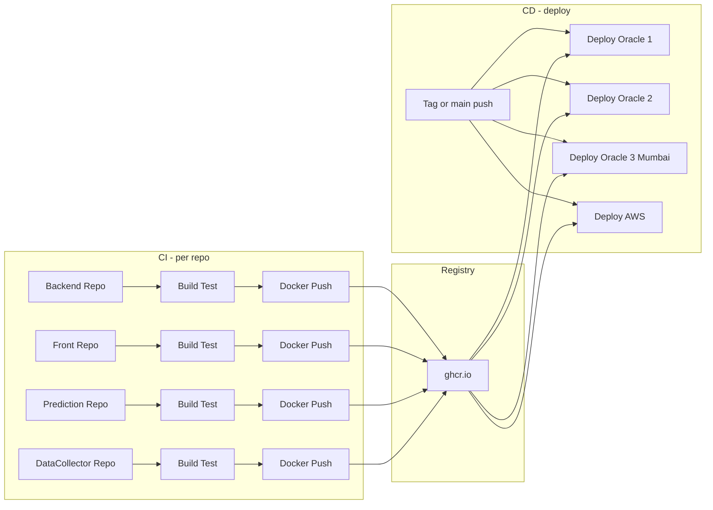

# CI/CD 점검 및 Oracle Cloud(VCN/서브넷·E2 증설) 설계

## 1. 현재 상태 요약

### 1.1 CI/CD

- **문서**: [investment-backend/docs/06-deployment/05-multi-vps-oracle-aws-cicd.md](investment-backend/docs/06-deployment/05-multi-vps-oracle-aws-cicd.md)에 GitHub Actions 기반 CI/CD 단계·트리거·시크릿·배포 순서가 정의되어 있음.
- **갭**:
  - **실제 워크플로우 없음**: 프로젝트 전체에 `.github/workflows/*.yml` 이 없음. CI/CD는 “권장 사항” 수준으로만 문서화되어 있음.
  - **레포 구조**: 멀티 레포 (investment-backend, investment-front, investment-data-collector, investment-prediction-service, investment-infra). CI는 각 레포 또는 상위(모노레포)에서 실행해야 하므로 트리거·의존 관계 설계 필요.
  - **Jenkinsfile**: [investment-prediction-service](investment-prediction-service)에만 존재. Jenkins 서버 연동 여부는 불명이며, 문서는 GitHub Actions를 권장.
  - **이미지 이름 불일치**: [docker-compose.aws.yml](investment-infra/docker-compose.aws.yml)은 `investment-frontend` 이미지를 참조하는데, 실제 프론트 레포는 `investment-front`. 레지스트리 이미지명과 레포명 정합성 검토 필요.

### 1.2 인프라·네트워크

- **배포 스크립트**: [investment-infra/scripts/](investment-infra/scripts/)에 `deploy-oracle1.sh`, `deploy-oracle2.sh`, `set-env-tags.sh` 등이 있고, 문서와 일치함.
- **네트워크**: 05-multi-vps 문서에는 “동일 VCN 내부라면 Private IP(예: 10.0.0.x)로 통신”이라고 되어 있으나, **Oracle Osaka와 Oracle Korea는 서로 다른 리전**이다. OCI에서 VCN은 리전 단위이므로 **두 리전은 동일 VCN 불가**. 따라서 현재 구성에서는 Oracle 1 ↔ Oracle 2 통신이 **Public IP** 또는 **Remote VCN Peering / VPN**을 통해 이루어져야 함.
- **VCN/서브넷 설계 문서 없음**: Terraform·OCI 콘솔 가이드·Security List·라우팅 등이 없음.

### 1.3 서버 구성

- **기존**: Oracle Osaka(데이터: TimescaleDB, Redis) + Oracle Korea(앱: Backend, prediction-service, data-collector). 스펙: VM.Standard.E2.1.Micro (1 OCPU, 1GB RAM).
- **증설 중**: **India West (Mumbai, ap-mumbai-1)** 에 osaka-yoon과 동일한 E2.1.Micro 스펙의 신규 노드 생성 중. 리전당 1 VCN이므로 Mumbai 전용 VCN·서브넷 설계에 포함한다.

---

## 2. CI/CD Flow 점검 및 보완 방향

### 2.1 문서 대비 갭 정리

| 항목     | 문서 내용                                                     | 현재 구현         | 조치                        |
| ------ | --------------------------------------------------------- | ------------- | ------------------------- |
| CI 트리거 | PR/푸시 시 빌드·테스트·이미지 푸시                                     | 없음            | GitHub Actions 워크플로우 추가   |
| CD 트리거 | main/release 푸시 또는 deploy 태그                              | 없음            | 배포 워크플로우 추가               |
| 빌드·테스트 | Backend: gradlew test bootJar, Front: npm ci/build/test 등 | 각 레포 로컬만      | 워크플로우에서 재현                |
| 이미지 푸시 | ghcr.io, 태그=commit SHA 7자리                                | 없음            | 각 서비스 Dockerfile 기준 빌드·푸시 |
| CD 실행  | SSH로 노드 접속 후 deploy-*.sh                                  | 수동 또는 SSH MCP | Actions에서 SSH 배포 job      |

### 2.2 권장 CI/CD 구조

- **레포 전략**: 멀티 레포 유지 시 **각 서비스 레포에 CI 워크플로우**를 두고, **배포(CD)는 한 곳에서 통합**하는 방식이 적합. “한 곳”은 investment-infra 또는 상위 auto-investment-project(또는 별도 deploy 레포).
- **CI (서비스별)**  
  - 트리거: 해당 레포의 PR/푸시 (main 또는 배포 브랜치).  
  - 단계: Checkout → Build & Test → Docker build → Push to ghcr.io (태그: `sha-${GITHUB_SHA::7}` 또는 `latest`).  
  - 시크릿: `GITHUB_TOKEN`(ghcr.io 푸시) 또는 PAT.
- **CD (통합)**  
  - 트리거: main(또는 release) 푸시, 또는 `deploy/*` 태그.  
  - 입력: 배포할 이미지 태그(기본값 `GITHUB_SHA` 7자리).  
  - 단계:  
    1. Oracle 1 (필요 시) — SSH로 `deploy-oracle1.sh`.
    2. Oracle 2 — `.env`에 `BACKEND_TAG`, `PREDICTION_TAG`, `DATA_COLLECTOR_TAG` 설정 후 `deploy-oracle2.sh`.
    3. **Oracle 3 (Mumbai)** — 동일하게 `.env` 설정 후 `deploy-oracle2.sh` 또는 Mumbai 전용 스크립트 실행.
    4. AWS 사용 시 — `FRONTEND_TAG` 설정 후 `deploy-aws.sh`.
  - 시크릿: `SSH_PRIVATE_KEY_ORACLE_OSAKA`, `SSH_PRIVATE_KEY_ORACLE_KOREA`, `SSH_PRIVATE_KEY_ORACLE_MUMBAI`, (선택) `SSH_PRIVATE_KEY_AWS`, 호스트 정보(또는 기존처럼 SSH config 상정).

이 흐름을 다이어그램으로 정리하면 다음과 같다.

### 2.3 점검 체크리스트 (문서 반영 권장)

- 각 서비스 레포에 Dockerfile 존재 여부: backend(문서상 예시만), front, data-collector, prediction-service(있음).
- 이미지 이름: `investment-frontend` vs `investment-front` 통일.
- investment-infra가 별도 레포일 때 CD 워크플로우 위치: infra 레포 또는 상위 레포에서 “이미지 태그만 받아 SSH 배포”하는 구조로 결정 후 문서화.

---

## 3. Oracle Cloud VCN·서브넷 설계 (Oracle Cloud 기준)

### 3.1 리전과 VCN 관계

- **Oracle Osaka**, **Oracle Korea**, **India West (Mumbai)** 는 각각 **서로 다른 리전**이다.
- OCI에서 **VCN은 리전 단위**이므로, 한 VCN으로 여러 리전을 묶는 것은 불가능하다.
- 따라서:
  - **리전당 1 VCN** 구성 (Osaka 1개, Korea 1개, **Mumbai 1개**).
  - **크로스 리전 통신**: 동일 VCN 내 Private IP 불가 → **Public IP**로 앱 노드(Korea, Mumbai)가 데이터 노드(Osaka)의 5432/6379에 접속. 추후 **Remote VCN Peering** 검토 가능.

### 3.2 리전별 VCN 설계 (권장)

**공통 원칙**

- VCN CIDR은 리전별로 겹치지 않게 하면, 추후 Peering 시 충돌이 없다 (예: Osaka `10.0.0.0/16`, Korea `10.1.0.0/16`).
- 퍼블릭 서비스(SSH, HTTP/HTTPS)는 Public Subnet, DB/Redis는 가능하면 Private Subnet(선택). 현재처럼 1GB E2 1대씩이면 **Public Subnet만**으로도 운영 가능하며, Security List로 포트 제한으로 보안 보완.

#### Option A: 리전당 1 VCN, Public Subnet 위주 (Osaka, Korea, Mumbai 3리전 대응)

| 리전                           | VCN 이름(예)                 | VCN CIDR        | 서브넷 이름(예)                    | 서브넷 CIDR        | 용도                                          |
| ---------------------------- | ------------------------- | --------------- | ---------------------------- | --------------- | ------------------------------------------- |
| Osaka (ap-osaka-1)           | vcn-investment-osaka      | 10.0.0.0/16     | public-investment-osaka      | 10.0.1.0/24     | 데이터 노드(Oracle 1)                            |
| Korea (ap-chuncheon-1)       | vcn-investment-korea      | 10.1.0.0/16     | public-investment-korea      | 10.1.1.0/24     | 앱 노드(Oracle 2)                              |
| **India West (ap-mumbai-1)** | **vcn-investment-mumbai** | **10.2.0.0/16** | **public-investment-mumbai** | **10.2.1.0/24** | **앱 노드(Oracle 3, 증설 중)** — E2.1.Micro 동일 스펙 |

- **인터넷 접속**: 각 VCN에 **Internet Gateway** 1개, 해당 서브넷의 기본 라우팅 테이블에 `0.0.0.0/0 → IGW` 추가.
- **E2 인스턴스**: 각 서브넷에 배치, Public IP 부여(또는 예약 Public IP). Private IP는 서브넷 CIDR 내 자동 할당.
- **Mumbai**: 신규 생성 시 위 표의 VCN·서브넷을 ap-mumbai-1 리전에 생성한 뒤, E2 인스턴스를 `public-investment-mumbai` 서브넷에 배치.

#### Option B: Private Subnet 추가 (데이터 계층 격리)

- 데이터 노드(DB/Redis)만 Private Subnet에 두고, 앱 노드는 Public Subnet에 두는 구성.
- Oracle 1을 Private Subnet에 두려면 **NAT Gateway**를 Public Subnet에 두고, Private 서브넷의 기본 라우팅을 NAT로 보내 아웃바운드만 허용. 인바운드는 **Bastion** 또는 “Public Subnet의 앱 → Private IP로 5432/6379” 접속이므로, **같은 리전**일 때 유리.
- **현재는 Osaka(데이터)와 Korea(앱)가 리전이 다르므로**, Oracle 1을 Private에 두면 Korea 앱이 Osaka Private IP에 직접 접근할 수 없음. 따라서 **Option A(Public 위주)** 가 단순하고, 보안은 Security List로 5432/6379를 Oracle 2(및 증설 노드) IP만 허용하는 방식이 현실적.

### 3.3 Security List (방화벽) 설계

**Oracle 1 (데이터, Osaka)**

| 방향      | 소스/대상                                                                       | 프로토콜·포트  | 용도          |
| ------- | --------------------------------------------------------------------------- | -------- | ----------- |
| Ingress | Oracle 2(Korea) Public IP/32, **Oracle 3(Mumbai) Public IP/32** (및 추가 앱 노드) | TCP 5432 | TimescaleDB |
| Ingress | 동일                                                                          | TCP 6379 | Redis       |
| Ingress | 관리자 IP 또는 배포 runner IP                                                      | TCP 22   | SSH         |
| Egress  | 0.0.0.0/0                                                                   | All      | 패키지/이미지 등   |

**Oracle 2 (앱, Korea)**

| 방향      | 소스/대상     | 프로토콜·포트     | 용도                                  |
| ------- | --------- | ----------- | ----------------------------------- |
| Ingress | 0.0.0.0/0 | TCP 80, 443 | HTTP/HTTPS (또는 Nginx가 AWS에 있으면 제한)  |
| Ingress | 관리자/배포 IP | TCP 22      | SSH                                 |
| Egress  | 0.0.0.0/0 | All         | Oracle 1(Public IP), ghcr.io, 기타 외부 |

**Oracle 3 (앱, India West Mumbai)** — 증설 노드

| 방향      | 소스/대상     | 프로토콜·포트     | 용도                                   |
| ------- | --------- | ----------- | ------------------------------------ |
| Ingress | 0.0.0.0/0 | TCP 80, 443 | HTTP/HTTPS (정책에 따라 제한 가능)            |
| Ingress | 관리자/배포 IP | TCP 22      | SSH                                  |
| Egress  | 0.0.0.0/0 | All         | Oracle 1(Osaka) Public IP, ghcr.io 등 |

- **크로스 리전**: Korea·Mumbai 앱 노드의 Backend가 Oracle 1(Osaka)에 접속할 때 **Oracle 1의 Public IP**를 사용. Oracle 1 Security List에서 **Oracle 2 + Oracle 3(Mumbai) Public IP**를 5432/6379 Ingress에 허용해야 한다.

### 3.4 E2 서버 증설 시 배치

- **동일 스펙**: VM.Standard.E2.1.Micro (1 OCPU, 1GB RAM). Always Free 한도 내에서 가능한지 테넌시 한도 확인 필요.
- **India West (Mumbai) 증설 (현재 진행 중)**:
  - **리전**: ap-mumbai-1. **VCN** `vcn-investment-mumbai` (10.2.0.0/16), **서브넷** `public-investment-mumbai` (10.2.1.0/24) 생성 후 E2 인스턴스 1대 배치.
  - **역할**: 앱 계층(Oracle 3) — Backend, prediction-service, data-collector. Oracle 1(Osaka)의 DB/Redis는 **Public IP**로 접속하므로, Oracle 1 Security List에 **Mumbai 인스턴스 Public IP**를 5432/6379 Ingress에 추가.
- **기타 증설 용도**:
  - **앱 2호기(스케일아웃/스테이징)**: Korea 또는 Mumbai VCN의 해당 Public 서브넷에 추가 인스턴스.
  - **데이터 전용 추가**: Osaka VCN의 `public-investment-osaka` 서브넷에 추가 인스턴스.
- **네트워크**: 모든 앱 노드(Korea, Mumbai, 추후 추가)의 Public IP를 Oracle 1(Osaka) Security List의 5432/6379 Ingress 허용 대상에 포함한다.

---

## 4. E2 서버 증설 절차 (설계)

### 4.1 India West (Mumbai) 신규 노드 — 적용 절차

- **리전**: **ap-mumbai-1 (India West, Mumbai)**. 용도: 앱 계층(Oracle 3).
- **VCN/서브넷**: Mumbai 리전에 **vcn-investment-mumbai** (10.2.0.0/16), **public-investment-mumbai** (10.2.1.0/24) 생성. Internet Gateway 연결, 기본 라우팅 테이블에 0.0.0.0/0 → IGW.
- **인스턴스 생성**:  
  - 이미지: Ubuntu 22.04 또는 문서와 동일한 이미지.  
  - Shape: VM.Standard.E2.1.Micro.  
  - 서브넷: `public-investment-mumbai`.  
  - SSH 키: 기존과 동일 키 또는 배포 전용 키(저장소에는 넣지 않음).  
  - 태그/이름: 예: `investment-app-mumbai`, `oci-mumbai` 등.
- **초기 설정**: Docker·Docker Compose 설치, investment-infra 클론, `.env`에 `SPRING_DATASOURCE_URL`(Oracle 1 Public IP), `REDIS_HOST`(Oracle 1 Public IP), `BACKEND_TAG` 등 설정. **Oracle 1(Osaka) Security List**에 Mumbai 인스턴스 **Public IP**에 대한 TCP 5432/6379 Ingress 규칙 추가.
- **문서·스크립트**:  
  - 05-multi-vps-oracle-aws-cicd.md에 “Oracle 3 (Mumbai)” 절 추가.  
  - 배포는 기존 `docker-compose.oracle2.yml` + `deploy-oracle2.sh` 재사용 가능. Mumbai 전용 호스트 변수만 다르게 두거나, `deploy-oracle3-mumbai.sh` 래퍼 추가.  
  - Cursor SSH config·SSH MCP에 새 호스트(예: `oci-mumbai`) 예시 추가.

### 4.2 기타 리전 증설 시

- **리전 선택**: 데이터 계층 → Osaka, 앱 계층 → Korea 또는 Mumbai.  
- **VCN/서브넷**: §3.2 Option A 표에 따라 해당 리전 VCN·서브넷 사용 또는 동일 스키마로 생성.  
- **문서·스크립트**: 05 문서 “증설 노드” 절, 필요 시 역할별 compose·배포 스크립트·SSH 호스트명 예시 추가.

---

## 5. 산출물 및 문서 배치

- **신규 문서 제안**  
  - **OCI VCN·서브넷 설계서**: `investment-backend/docs/06-deployment/06-oci-vcn-subnet-design.md` (또는 `investment-infra/docs/`).  
    - 리전별 VCN/서브넷 표(Osaka, Korea, **Mumbai**), CIDR, Security List 요약, 크로스 리전 통신(Public IP 사용), E2 증설 시 배치 원칙.
- **기존 문서 수정**  
  - [05-multi-vps-oracle-aws-cicd.md](investment-backend/docs/06-deployment/05-multi-vps-oracle-aws-cicd.md): §4 네트워크에 “동일 VCN 불가(리전 상이)” 명시, Oracle 1↔2↔3은 Public IP 참조, 신규 설계서(06) 링크.  
  - 동일 문서에 “E2 증설” 절 추가: **Oracle 3 (India West Mumbai)** 포함, 용도별 리전·서브넷, Security List 업데이트(Oracle 1에 Mumbai IP 허용), 배포 스크립트/호스트명(예: oci-mumbai) 예시.
- **CI/CD**  
  - 점검 결과와 권장 구조(§2)를 05 문서 또는 별도 `07-cicd-implementation-checklist.md`에 “CI/CD 구현 체크리스트”로 정리.  
  - 실제 워크플로우 추가는 구현 단계에서 `.github/workflows` 생성.

---

## 6. 구현 시 우선순위 제안

1. **문서**: OCI VCN/서브넷 설계서(06) 작성 및 05 문서의 네트워크·증설 절 보완.
2. **CI**: 서비스별 GitHub Actions CI (build, test, docker push) 추가.
3. **CD**: 배포용 워크플로우 및 시크릿 설정.
4. **인프라**: 증설 시 OCI 콘솔(또는 Terraform)로 VCN/서브넷/SL 정리 후 E2 인스턴스 추가, 배포 스크립트·문서 반영.

이 계획은 **편집/실행 없이** 설계·점검 결과만 정리한 것이며, 실제 파일 수정·워크플로우 추가·OCI 리소스 생성은 사용자 승인 후 진행하면 된다.