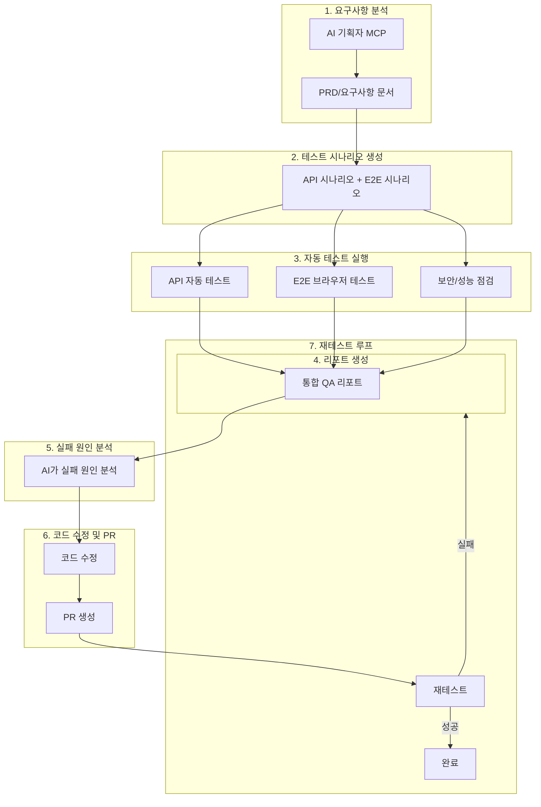

# Cursor 기준 전체 자동화 QA — MCP·Extension 세팅 계획

## 1. 현재 구조 요약

| 구분       | 프로젝트                                       | 테스트/QA 현황                                                                                                                                              |
| -------- | ------------------------------------------ | ------------------------------------------------------------------------------------------------------------------------------------------------------ |
| Backend  | [investment-backend](investment-backend)   | JUnit5 + @WebMvcTest 등 slice test. `.\scripts\run-tests.ps1`, `run-tests-with-coverage.ps1` (5분 타임아웃 권장)                                               |
| Frontend | [investment-frontend](investment-frontend) | Vitest(단위), Playwright E2E (`e2e/login.spec.ts`, `e2e/landing.spec.ts`). `npm run e2e` (webServer로 Vite 5173 자동 기동)                                    |
| 기타       | smart-portfolio-pal                        | Vitest만 있음. E2E 없음                                                                                                                                     |
| 인프라      | [investment-infra](investment-infra)       | [docker-compose.local-full.yml](investment-infra/docker-compose.local-full.yml). 풀스택 기동: `local-up.ps1`                                                |
| QA 문서    | [plans/qa/](plans/qa/)                     | [QA_시나리오_마스터.md](plans/qa/QA_시나리오_마스터.md), [api-qa.http](plans/qa/api-qa.http), [최종_QA_체크리스트.md](plans/qa/최종_QA_체크리스트.md). 수동 REST Client + 브라우저 검증 안내 |

이미 규칙([test-code-after-agent-by-plan.mdc](.cursor/rules/test-code-after-agent-by-plan.mdc))에서 백엔드 테스트·프론트 E2E(Playwright/브라우저) 실행과 “실패 시 수정 후 재실행”을 요구하고 있음.

---

## 2. 목표 Flow (7단계 파이프라인)

요청하신 흐름을 그대로 반영한 전체 사이클입니다.

| 단계                 | 내용                                                  | 담당/도구                                                   |
| ------------------ | --------------------------------------------------- | ------------------------------------------------------- |
| **1. 요구사항 분석**     | PRD·기획 문서를 AI가 읽고 검증 범위·시나리오 초안 도출                  | AI 기획자 MCP (Conductor Tasks 등) 또는 Agent + @docs         |
| **2. 테스트 시나리오 생성** | 분석 결과 → API 시나리오 스크립트, Playwright spec, 보안/성능 체크리스트 | Agent + QA_시나리오_마스터·api-qa.http 연동                      |
| **3. 자동 테스트**      | API 자동 테스트 + E2E 브라우저 테스트 + 보안/성능 점검 동시 또는 순차 실행    | run-full-qa.ps1 + 보안·성능 스크립트                            |
| **4. 리포트 생성**      | 각 실행 결과를 한 곳에 모아 통합 QA 리포트(Markdown + HTML) 생성      | 스크립트가 `plans/qa/reports/` 등에 출력                         |
| **5. 실패 원인 분석**    | AI가 리포트·로그·스택·스크린샷을 읽고 실패 원인 분석                     | Agent(Composer)                                         |
| **6. 코드 수정·PR**    | 분석 기반 코드 수정 후 브랜치·PR 생성                             | Agent + GitHub MCP (create_branch, create_pull_request) |
| **7. 재테스트**        | PR 머지 전 또는 로컬에서 전체 QA 재실행 → 실패 시 4→5→6→7 반복         | 동일 스크립트 + 루프 규칙                                         |

- **시나리오 SSoT**: [plans/qa/QA_시나리오_마스터.md](plans/qa/QA_시나리오_마스터.md) + [api-qa.http](plans/qa/api-qa.http). 1단계 요구사항 변경 시 2단계에서 여기 반영 후 테스트 코드/스크립트와 동기화.

---

## 3. MCP 제안 (7단계 파이프라인 기준)

### 3.1 AI 기획자 / 요구사항 분석 (1단계)

- **Conductor Tasks MCP**  
  - PRD 분석, 구현 단계 생성, AI 코딩 지원. Cursor에서 MCP로 연동 가능.  
  - 설치: [Cursor Directory - Conductor Tasks](https://cursor.directory/mcp/conductor-tasks), [GitHub](https://github.com/hridaya423/conductor-tasks).  
  - 1단계 “요구사항 분석”에서 PRD·기획 문서를 읽고 검증 범위·시나리오 초안을 도출하는 데 사용.
- **대안**: PRD/요구사항을 `@docs` 또는 Filesystem MCP로 Agent에 넘기고, “이 요구사항 기준으로 QA 시나리오 목록을 만들어줘”처럼 지시해 2단계 입력 생성.

### 3.2 cursor-ide-browser (E2E·3단계 브라우저 검증)

- **역할**: 브라우저에서 “진짜처럼” 시나리오 실행 — 로그인 → 메뉴 클릭 → 스냅샷/폼 입력/검증. 실패 시 DOM·스크린샷을 Agent 컨텍스트로 제공해 수정 유도.
- **설정**: Cursor Settings → Features → MCP에 이미 등록돼 있다고 가정. 프로젝트 [.cursor/mcp.json.template](.cursor/mcp.json.template)에는 없고, 사용자 전역 MCP 설정에 두는 구성이 일반적.
- **워크플로**: 풀스택(local-up.ps1) 또는 백엔드만 8084 기동 후 `http://localhost` 또는 `http://localhost:5173` 접속 → `browser_navigate` → `browser_snapshot` → `browser_click`/`browser_type` 등으로 [최종_QA_체크리스트.md](plans/qa/최종_QA_체크리스트.md) §7 메뉴별 검증을 스텝으로 수행.
- **규칙 반영**: [test-code-after-agent-by-plan.mdc](.cursor/rules/test-code-after-agent-by-plan.mdc)에서 “Frontend/screen changes: cursor-ide-browser MCP 또는 Playwright E2E”로 이미 명시됨.

### 3.3 TestSprite MCP (선택 — 클라우드·가입)

- **역할**: PRD/문서 기반 테스트 플랜 생성, UI·API 테스트 실행, 자동 수정 피드백 루프. “시나리오 짜고 전부 테스트 후 코드 수정”에 가까움.
- **설치**: [Cursor Directory - TestSprite MCP](https://cursor.directory/mcp/testsprite-mcp), [설치 문서](https://docs.testsprite.com/mcp/installation). Cursor Settings → MCP → Add New MCP Server에서 stdio/SSE 설정.
- **고려사항**: 클라우드 샌드박스·가입·비용 확인 필요. 이미 있는 Playwright + cursor-ide-browser만으로도 시나리오 기반 QA와 “실패 → 수정” 루프는 가능.

### 3.4 GitHub MCP (6단계 PR 생성)

- **역할**: 브랜치 생성, **Pull Request 생성**, 이슈·PR 목록 조회. 6단계 “코드 수정 PR 생성”에서 Agent가 수정 후 `create_branch` → 커밋 푸시 → `create_pull_request` 호출.
- **설정**: 프로젝트 [.cursor/mcp.json.template](.cursor/mcp.json.template)에 이미 `github` 항목 있음. `GITHUB_TOKEN`(PAT)에 repo·workflow 권한 부여 시 PR 생성 가능. [GitHub MCP 가이드](https://docs.github.com/en/copilot/how-tos/provide-context/use-mcp/use-the-github-mcp-server) 참고.

### 3.5 기타 MCP (유지)

- **Shrimp Task Manager**: QA 시나리오·체크리스트를 태스크로 분해하고 “전체 QA 실행” 태스크 완료 조건(모든 테스트 통과) 명시.
- **Filesystem**: 리포트·테스트 결과 파일 읽기/쓰기, 시나리오 문서 접근.

---

## 4. Extension 제안

### 4.1 Playwright Test for VS Code (권장)

- **역할**: [investment-frontend](investment-frontend)의 Playwright E2E를 에디터에서 실행·디버깅·리포트. 스펙 옆 재생 버튼, 다중 브라우저, 실패 스크린샷/트레이스 확인.
- **설치**: Cursor 확장 마켓에서 “Playwright Test” (Microsoft) 검색 후 설치. 프로젝트에 `playwright.config.ts`·`e2e/*.spec.ts` 이미 있으므로 바로 사용 가능.
- **사용**: `e2e/login.spec.ts` 등 열고 재생 아이콘 클릭, 또는 테스트 탐색기에서 전체 E2E 실행. Agent가 “npm run e2e”를 터미널로 돌릴 때와 동일한 스펙 실행.

### 4.2 REST Client 또는 Thunder Client (선택)

- **역할**: [plans/qa/api-qa.http](plans/qa/api-qa.http)를 에디터에서 실행. 로그인 → `@token` 설정 → 블록 순차 Send Request로 API 시나리오 수동 검증. 자동화는 아래 §5의 스크립트로 보완.
- **설치**: “REST Client” (Huachao Mao) 또는 “Thunder Client” 검색 후 설치.

### 4.3 기타

- **Gradle for Java**: 백엔드 테스트 실행·디버깅(이미 사용 중일 수 있음).
- **TestSprite**: Extension이 있다면 Cursor 디렉터리/공식 문서 기준으로 추가 검토.

---

## 5. 자동화 워크플로 통합 (7단계 상세)

### 5.1 2단계: 테스트 시나리오 생성

- **입력**: 1단계에서 도출한 요구사항·검증 범위(또는 기존 [QA_시나리오_마스터.md](plans/qa/QA_시나리오_마스터.md)).
- **산출물**:  
  - API 시나리오: [api-qa.http](plans/qa/api-qa.http) 또는 로그인 → Bearer 순차 호출 스크립트용 엔드포인트·예상 코드 목록.  
  - E2E 시나리오: [investment-frontend/e2e/](investment-frontend/e2e/)에 추가할 Playwright spec 초안(로그인·메뉴·폼 등).  
  - 보안/성능: 체크리스트(의존성 검사, 기본 보안 헤더, 응답 시간 임계값 등).
- **담당**: Agent가 Conductor 또는 PRD 문서를 참고해 위 산출물 초안 생성 후, 필요 시 [QA_시나리오_마스터.md](plans/qa/QA_시나리오_마스터.md)와 동기화.

### 5.2 3단계: API 자동 테스트 + E2E 브라우저 테스트 + 보안/성능 점검

1. **전제**: 로컬 풀스택은 사용자가 [local-up.ps1](investment-infra/scripts/README.md)으로 이미 띄워 둔 상태. 또는 Backend 8084, Frontend 5173 등 필요한 조합.
2. **Backend (API·단위)**: `investment-backend`에서 `.\scripts\run-tests.ps1` (타임아웃 300000ms).
3. **API 시나리오(자동화)**: 로그인 1회 → Bearer로 [QA_시나리오_마스터.md](plans/qa/QA_시나리오_마스터.md) 엔드포인트 순차 호출하는 PowerShell/Node 스크립트. 예상 상태 코드 검증, 불일치 시 실패 반환.
4. **Frontend E2E**: `investment-frontend`에서 `npm run e2e` (Playwright). 실패 시 스크린샷·트레이스가 4단계 리포트로 전달.
5. **보안/성능 점검**:
  - 보안: `npm audit`(frontend), Gradle dependency check 또는 OWASP 등(backend).  
  - 성능: 선택적으로 Lighthouse 또는 API 응답 시간 임계값 검사 스크립트.  
   이 결과도 4단계 리포트에 포함.
6. **(선택) cursor-ide-browser**: Agent가 “[http://localhost](http://localhost) 로그인 후 대시보드·설정·주문 메뉴 검증해줘”처럼 지시해 브라우저 시나리오 실행.

### 5.3 4단계: 리포트 생성

- **목적**: 3단계 실행 결과를 한 곳에 모아, 5단계 AI 실패 분석과 7단계 재테스트에서 사용.
- **산출물**:  
  - 통합 QA 리포트: `plans/qa/reports/YYYYMMDD-HHMM-qa-report.md` (요약·통과/실패·실패 목록·로그 위치).  
  - 기존 산출물 유지: Backend JUnit 리포트, Playwright HTML 리포트(`playwright-report/`), 보안 스캔 결과 요약.
- **구현**: `run-full-qa.ps1`(또는 동등 스크립트)가 각 단계 실행 후 exit code·stdout/stderr를 수집해 위 Markdown 리포트를 생성. 실패 시 해당 로그·스택·스크린샷 경로를 리포트에 기입.

### 5.4 5단계: AI 실패 원인 분석

- Agent(Composer)가 4단계 리포트·실패 로그·스택·Playwright 스크린샷을 읽고, 실패 원인 분석 및 수정 포인트 제안.
- Rule에서 “전체 QA 실행 후 실패 시 반드시 리포트와 로그를 참고해 원인 분석 후 수정” 명시.

### 5.5 6단계: 코드 수정 및 PR 생성

- Agent가 5단계 분석을 바탕으로 코드 수정.
- **PR 생성**: GitHub MCP로 `create_branch` → (로컬에서 커밋·푸시 또는 MCP로 푸시) → `create_pull_request`. PAT에 repo 권한 필요.
- **대안**: PR 없이 로컬만 수정 후 7단계 재테스트로 바로 진입.

### 5.6 7단계: 재테스트 루프

- 수정 반영 후 동일한 “전체 QA” 스크립트 재실행(3단계 → 4단계).  
- **실패 시**: 4단계 리포트 갱신 → 5단계(실패 원인 분석) → 6단계(코드 수정·PR) → 7단계(재테스트) 반복.  
- **성공 시**: 루프 종료. PR 머지 또는 완료 처리.

### 5.7 Rule·문서 보강

- **Rule**: “전체 자동화 QA 실행 시 3단계(Backend + API 시나리오 + E2E + 보안/성능) → 4단계 리포트 생성. 실패 시 5단계(실패 원인 분석) → 6단계(코드 수정·PR) → 7단계 재테스트 루프”를 [test-code-after-agent-by-plan.mdc](.cursor/rules/test-code-after-agent-by-plan.mdc) 또는 새 rule `qa-automation-flow.mdc`에 명시.
- **문서**: [최종_QA_체크리스트.md](plans/qa/최종_QA_체크리스트.md) “재실행 방법”에 “전체 자동 실행: `.\scripts\run-full-qa.ps1` → 리포트: `plans/qa/reports/`” 추가.

---

## 6. 권장 세팅 요약 (7단계 파이프라인 기준)

| 구분        | 항목                           | 단계      | 비고                                           |
| --------- | ---------------------------- | ------- | -------------------------------------------- |
| MCP       | **Conductor Tasks** (AI 기획자) | 1       | PRD 분석, 시나리오 초안 도출                           |
| MCP       | **cursor-ide-browser**       | 3       | E2E 브라우저 시나리오 실행, 실패 시 컨텍스트 제공               |
| MCP       | **GitHub**                   | 6       | create_branch, create_pull_request (PAT 필요)  |
| MCP       | TestSprite MCP               | 선택      | PRD→테스트 플랜→실행→수정, 클라우드/가입 확인                 |
| MCP       | Shrimp                       | 전 단계    | QA 태스크·체크리스트 관리                              |
| MCP       | Filesystem                   | 2, 4, 5 | 시나리오·리포트 읽기/쓰기                               |
| Extension | Playwright Test for VS Code  | 3       | E2E 실행·디버깅·리포트                               |
| Extension | REST Client / Thunder Client | 선택      | api-qa.http 수동 실행                            |
| 스크립트      | run-full-qa.ps1(또는 동등)       | 3, 4, 7 | Backend + API 시나리오 + E2E + 보안/성능 → 통합 리포트 생성 |
| Rule      | qa-automation-flow.mdc       | 5, 7    | 실패 시 원인 분석 → 수정·PR → 재테스트 루프 명시              |

---

## 7. 구현 시 참고 파일

- Backend 테스트: [investment-backend/scripts/run-tests.ps1](investment-backend/scripts/run-tests.ps1), [script-run-timeouts.mdc](.cursor/rules/script-run-timeouts.mdc).
- Frontend E2E: [investment-frontend/playwright.config.ts](investment-frontend/playwright.config.ts), [investment-frontend/e2e/](investment-frontend/e2e/). baseURL 5173, 백엔드는 proxy로 8080 전제.
- API 시나리오: [plans/qa/api-qa.http](plans/qa/api-qa.http), [plans/qa/QA_시나리오_마스터.md](plans/qa/QA_시나리오_마스터.md). 자동화 스크립트는 로그인 후 `Authorization: Bearer {token}` + 예상 상태 코드 검증.
- 풀스택 기동: [investment-infra/scripts/local-up.ps1](investment-infra/scripts/local-up.ps1), [docker-compose.local-full.yml](investment-infra/docker-compose.local-full.yml). 접속: [http://localhost](http://localhost) (Nginx), Backend 8080.

이 구성을 적용하면 Cursor에서 **요구사항 분석(AI 기획자 MCP) → 테스트 시나리오 생성 → API 자동 테스트 + E2E 브라우저 테스트 + 보안/성능 점검 → 리포트 생성 → AI 실패 원인 분석 → 코드 수정·PR 생성 → 재테스트 루프**까지 요청하신 7단계 파이프라인을 한 사이클로 운영할 수 있습니다.