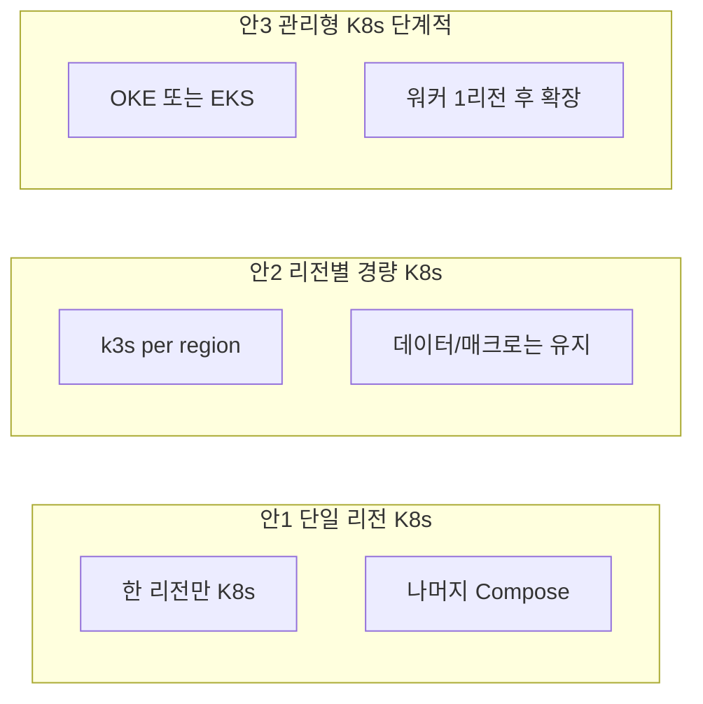

# Kubernetes 오케스트레이션 3안

## 1. 전제와 목적

### 1.1 현재 구조

- **노드**: Oracle 1 (Osaka, 데이터) · Oracle 2 (Korea, 앱) · Oracle 3 (Mumbai, 매크로) · AWS (선택, 엣지/API).
- **오케스트레이션**: 노드별 **Docker Compose** (region-role별 compose 파일).
- **제약**: 노드당 1GB RAM(OCI E2.1.Micro), 리전별 VCN 분리(동일 VCN 불가), 공인 IP 기반 통신.

### 1.2 Kubernetes 도입 검토 이유

- 서버가 여러 대(3~4대)로 늘어나 **배포·설정·헬스·재기동**을 한 곳에서 관리하고 싶을 때.
- 향후 **스케일 아웃·롤링 업데이트·서비스 디스커버리**를 표준 방식으로 쓰고 싶을 때.
- 프로젝트 문서([01-deployment-guide.md](investment-backend/docs/06-deployment/01-deployment-guide.md))에 이미 “프로덕션은 Kubernetes 권장” 문구가 있으나, 요구사항([best-architecture-requirement.md](investment-backend/docs/01-requirements/best-architecture-requirement.md))은 단일 사용자 구간에서는 **ops 절감을 위해 Compose 유지**를 전제로 함. 따라서 **다수 서버를 전제로 할 때만** K8s 3안을 검토하는 것이 맞음.

---

## 2. 제약 요약

| 항목        | 내용                                                                                 |
| --------- | ---------------------------------------------------------------------------------- |
| **메모리**   | OCI 노드 1GB. K8s control plane 또는 에이전트만 있어도 수백 MB 소요. 워크로드와 동시에 두기엔 빡빡함.            |
| **멀티 리전** | Osaka / Korea / Mumbai / AWS는 서로 다른 리전. 단일 클러스터로 묶으면 control plane–노드 간 지연·가용성 이슈. |
| **네트워크**  | 리전별 VCN. Pod 간 통신을 단일 overlay로 쓰려면 복잡도·비용 증가.                                      |
| **비용**    | Managed K8s(OKE/EKS)는 제어평면 비용 + 워커 비용. 1GB 워커만 써도 제어평면 최소 스펙이 있을 수 있음.             |

---

## 3. 3안 개요

---

## 4. 안1 — 단일 리전 Kubernetes + 나머지 Compose 유지

### 4.1 설계

- **K8s 적용 범위**: **한 리전만** (Oracle Korea **또는** AWS 서울 중 하나).
- **해당 리전**: 앱 스택(Backend, prediction-service, data-collector, Nginx)을 K8s Deployment/Service로 운영.
- **그 외**: Oracle 1 (Osaka) = DB/Redis는 **기존 Compose 유지**. Oracle 3 (Mumbai) = 매크로(Jenkins) **Compose 유지**. AWS(또는 Oracle 2)에 엣지(Nginx+Frontend)가 있으면 그 노드는 Compose 또는 정적 호스팅만.

### 4.2 옵션

| 옵션  | K8s 클러스터 위치              | 워커 스펙    | 비고                                                                          |
| --- | ------------------------ | -------- | --------------------------------------------------------------------------- |
| 1-A | Oracle 2 (Korea) 1대만 워커  | 1GB (빡빡) | k3s 또는 microk8s 권장. control plane 별도 1대 두기 어려우면 single-node k3s.            |
| 1-B | AWS 서울 1대 (t3.small 2GB) | 2GB      | 제어평면+워커 한 대에 k3s 또는 EKS Anywhere / minikube 유사. 또는 EKS 관리형 제어평면 + 1개 워커 노드. |

### 4.3 장단점

- **장점**: 변경 범위 작음. 데이터·매크로는 기존 Compose 그대로. K8s 학습·도입을 한 리전에만 적용 가능.
- **단점**: “여러 서버를 K8s로 통일”이라는 목적에는 부족. 1GB에서 K8s 워크로드까지 돌리면 OOM 위험 여전.

### 4.4 적용 시 참고

- [01-deployment-guide.md §5](investment-backend/docs/06-deployment/01-deployment-guide.md)의 Deployment/Service 예시를 해당 리전용 매니페스트로 변환.
- 시크릿은 K8s Secret 또는 (AWS 시) Secrets Manager 연동.
- 로그 경로 `/LOG`는 [03-non-functional-requirements](investment-backend/docs/01-requirements/03-non-functional-requirements.md)에 맞게 volumeMount.

---

## 5. 안2 — 리전별 경량 Kubernetes (k3s) 멀티클러스터

### 5.1 설계

- **리전별 k3s 클러스터** 1개씩: Osaka, Korea, Mumbai (필요 시 AWS도 1클러스터).
- **Osaka**: k3s 노드 1대에 TimescaleDB + Redis를 Pod(또는 Helm) 또는 **기존 Compose 유지**하고 k3s에는 미배포 중 선택.
- **Korea**: k3s로 Backend, prediction, data-collector, Nginx(api) 배포.
- **Mumbai**: k3s로 Jenkins(매크로)만 배포하거나, 매크로는 Compose 유지하고 k3s는 나중에 확장용으로만 구축.
- **AWS**: k3s 또는 EKS. Nginx + Frontend.

### 5.2 통합 관리

- **GitOps**: Flux 또는 Argo CD로 클러스터별 매니페스트/Helm 동기화. 저장소는 investment-infra 또는 별도 k8s-manifests.
- **다중 클러스터**: 서비스 메시(Linkerd/Istio)는 1GB·멀티리전 환경에서는 부담될 수 있음. 초기에는 **클러스터 간 통신은 기존처럼 공인 IP(DB/Redis)** 로 두고, K8s는 “리전 내” 오케스트레이션만 담당.

### 5.3 장단점

- **장점**: 리전별로 역할이 명확. 확장 시 해당 리전에서만 노드 추가 가능. OCI 1GB에서 k3s single-node는 가능한 편.
- **단점**: 클러스터 3~4개 운영·업그레이드·백업 정책을 따로 가져가야 함. 멀티클러스터 지식 필요.

### 5.4 적용 시 참고

- k3s: [k3s.io](https://k3s.io) — single binary, 경량. 1GB 노드에서 동작 사례 많음.
- 매니페스트/Helm은 [investment-infra](investment-infra/) 아래 `k8s/` 또는 `helm/` 디렉터리로 버전 관리 권장.

---

## 6. 안3 — 관리형 Kubernetes(OKE/EKS) 단계적 도입

### 6.1 설계

- **1단계**: **한 리전에만** 관리형 클러스터 생성.
  - **OKE (Oracle)** : Korea 또는 Mumbai 리전에 OKE 클러스터 1개. 워커 풀 1개(노드 1~2대). 노드는 2GB 이상 권장(1GB는 워크로드만 해도 빡빡).
  - **EKS (AWS)** : 서울 리전에 EKS 클러스터 1개. 워커 1대(t3.small 2GB). API 스택 전부 EKS로 이전.
- **2단계**: 데이터 계층(Oracle 1 Osaka)은 **클러스터 밖** 유지. DB/Redis는 기존 VM + Compose 또는 OCI/AWS 관리형 DB(예: RDS, OCI MySQL)로 이전 검토.
- **3단계**: 필요 시 Oracle 2(Korea) 또는 Mumbai에 두 번째 워커 풀/노드 추가하거나, 두 번째 클러스터(OKE/EKS)를 만들어 엣지·매크로를 나눠 넣음.

### 6.2 비용·제약

- **OKE**: 제어평면 무료(OCI 정책 확인 필요). 워커 노드 비용만. 2GB 워커 1대면 유료.
- **EKS**: 제어평면 시간당 비용 + 워커 노드. 소규모라도 월 수십 달러 단위 예상.
- **1GB 워커**: 관리형이라도 1GB 워커만 쓰면 OOM 가능성 동일. 2GB 이상 권장.

### 6.3 장단점

- **장점**: 패치·HA·스케일은 클라우드가 담당. 팀이 K8s만 익히면 됨.
- **단점**: 비용·초기 설정 부담. “서버가 많아서”가 아니라 “표준 플랫폼으로 통일하고 싶을 때”에 맞음.

### 6.4 적용 시 참고

- [01-deployment-guide.md §5](investment-backend/docs/06-deployment/01-deployment-guide.md), [03-non-functional-requirements](investment-backend/docs/01-requirements/03-non-functional-requirements.md) 로그·시크릿.
- Ingress는 OKE LoadBalancer / AWS ALB 연동으로 api. · app. 라우팅.

---

## 7. 3안 비교표

| 항목         | 안1 단일 리전 K8s            | 안2 리전별 k3s 멀티클러스터        | 안3 관리형 OKE/EKS 단계적     |
| ---------- | ----------------------- | ------------------------ | ---------------------- |
| **변경 범위**  | 한 리전만 K8s, 나머지 Compose  | 리전마다 k3s, 데이터/매크로는 선택    | 한 리전 관리형 → 점진 확장       |
| **노드 스펙**  | 1GB 가능(경량 K8s) / 2GB 권장 | 1GB에 k3s single-node 가능  | 워커 2GB 이상 권장           |
| **운영 복잡도** | 낮음                      | 중~높음(멀티클러스터·GitOps)      | 중(관리형이지만 YAML/Helm 필요) |
| **비용**     | 기존 대비 거의 동일             | 워커 비용만(제어평면 무료)          | EKS/OKE 제어평면 + 워커      |
| **적합 상황**  | “한 곳만 K8s로 바꿔보고 싶을 때”   | “리전별로 역할 나누고 전부 K8s로 통일” | “장기적으로 관리형 K8s 표준화”    |

---

## 8. 권장 선택 가이드

- **당장 서버만 많고, 통일된 오케스트레이션보다 안정성이 우선**이면: **현재 Compose 유지**가 합리적. [05-multi-vps-oracle-aws-cicd.md](investment-backend/docs/06-deployment/05-multi-vps-oracle-aws-cicd.md)·모니터링 스크립트로 관리 강화.
- **한 리전만 K8s로 전환해보고 싶다**면: **안1** (Korea 또는 AWS 한 대에 k3s + 앱 스택).
- **리전별로 역할을 나누되 전부 K8s로 통일하고, 비용은 제어평면 없이 가져가고 싶다**면: **안2** (리전별 k3s + GitOps).
- **비용을 감수하고 관리형 플랫폼으로 표준화하겠다**면: **안3** (OKE 또는 EKS 1클러스터 → 단계적 확장).

---

## 9. 문서·결정 반영

- 이 3안을 **아키텍처 검토용**으로만 둘지, **선택한 1안을 실행 계획(마일스톤·태스크)** 으로 풀지 결정 후:
  - 선택안이 정해지면 [decisions.md](docs/decisions.md)(또는 프로젝트 내 아키텍처 결정 문서)에 “Kubernetes 오케스트레이션 3안 중 채택안 및 사유”를 ADR로 추가.
  - [05-multi-vps-oracle-aws-cicd.md](investment-backend/docs/06-deployment/05-multi-vps-oracle-aws-cicd.md) 상단에 “K8s 전환 시 [.cursor/plans/kubernetes_오케스트레이션_3안.plan.md](.cursor/plans/kubernetes_오케스트레이션_3안.plan.md) 참조” 링크 추가하면, 나중에 바로 찾기 쉬움.

