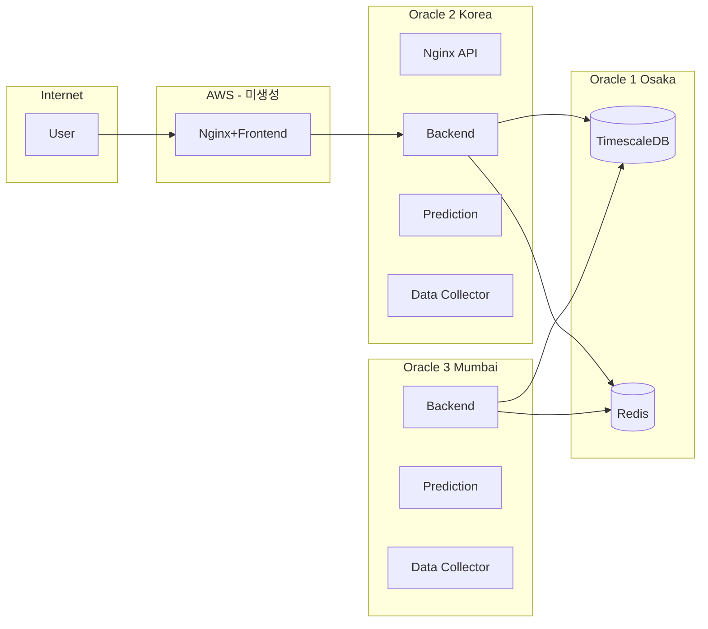
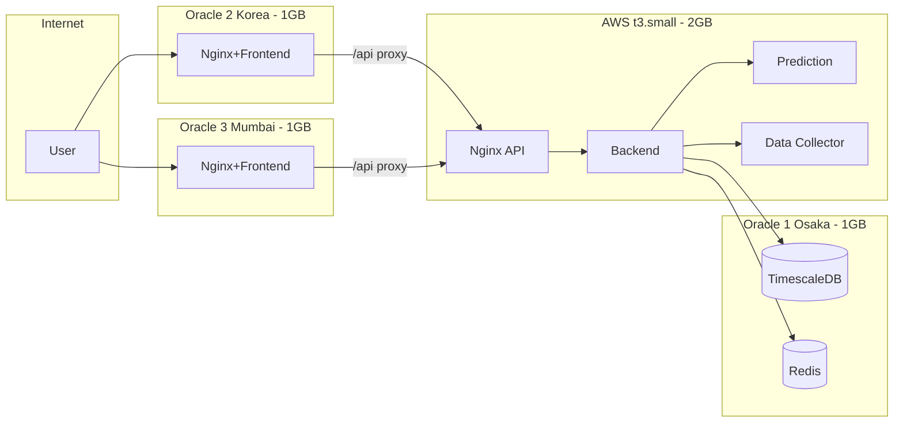
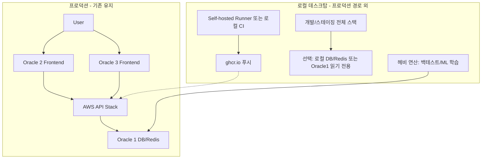
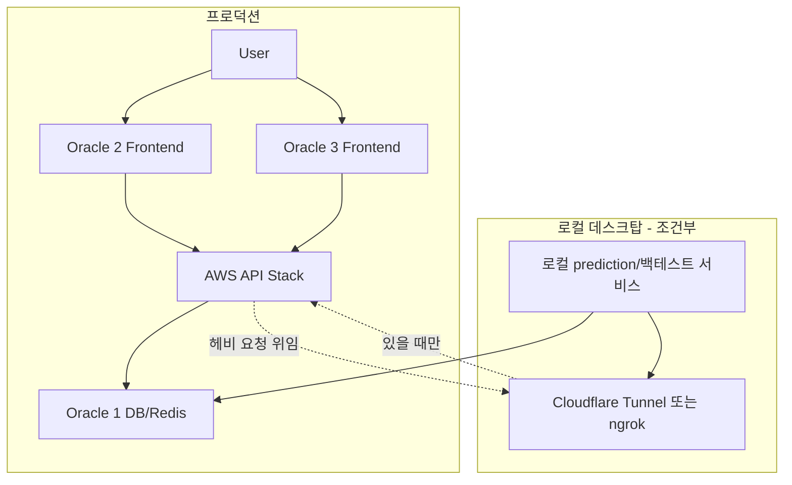

# Oracle 3대 배포 재설계 및 AWS 검토

## 1. 현재 인프라 배포 구조 요약

### 1.1 노드·역할·Compose 매핑

| 노드           | 리전                     | 역할       | Compose                                                                   | 서비스                                                                      | 공개 도메인                         |
| ------------ | ---------------------- | -------- | ------------------------------------------------------------------------- | ------------------------------------------------------------------------ | ------------------------------ |
| **Oracle 1** | Osaka (ap-osaka-1)     | 데이터 계층   | [docker-compose.oracle1.yml](investment-infra/docker-compose.oracle1.yml) | TimescaleDB(5432), Redis(6379)                                           | 없음(앱 노드만 접속)                   |
| **Oracle 2** | Korea (ap-chuncheon-1) | 앱 계층     | [docker-compose.oracle2.yml](investment-infra/docker-compose.oracle2.yml) | backend(8080), prediction(8000), data-collector(8001), **nginx(80/443)** | **api.*** (api.conf만 사용)       |
| **Oracle 3** | Mumbai (ap-mumbai-1)   | 앱 계층(동일) | 동일 oracle2.yml                                                            | Oracle 2와 동일                                                             | 현재 문서상 api는 Oracle 2 또는 3 중 하나 |
| **AWS**      | 미정                     | 엣지 계층    | [docker-compose.aws.yml](investment-infra/docker-compose.aws.yml)         | frontend, nginx                                                          | **app.*** (미생성)                |

- Oracle 2의 nginx는 **api.conf만** 사용 중(api.EXAMPLE_DOMAIN → backend:8080). **app.conf**(frontend)는 AWS 전용으로만 존재.
- Oracle 3는 [deploy-oracle3-mumbai.sh](investment-infra/scripts/deploy-oracle3-mumbai.sh)로 **deploy-oracle2.sh**를 그대로 실행해 Oracle 2와 동일 스택만 배포.
- 문서([11-dns-and-domain-setup.md](investment-backend/docs/06-deployment/11-dns-and-domain-setup.md)): app.* 는 “설계상 AWS”이나 “임시로 Oracle Korea/Mumbai 중 한 노드에 frontend를 두고 그 노드 Public IP 사용 가능”으로 이미 허용.

### 1.2 토폴로지(문서 기준)

- 현재 **Frontend/App** 은 AWS에만 설계되어 있고, AWS 인스턴스는 없음 → app.* 레코드는 비우거나 임시로 Oracle 2/3 한 노드 IP를 써야 함.

---

## 2. 기획의도·목적 정리

- **데이터 분리**: Oracle 1(Osaka)에 DB/Redis만 두어 장애 격리 및 리소스 보장.
- **앱 계층 증설**: Oracle 2(Korea)·Oracle 3(Mumbai)로 지역/가용성 분산(동일 스택 복제).
- **엣지(프론트)**: 원래 AWS 1대로 Nginx+Frontend 예정이었으나 **미생성** → Oracle 3대로만 운영하려면 한 노드에서 app을 서빙해야 함.

---

## 2.5 서비스별 RAM 비교분석 (1GB 노드 수용 여부)

**기준**: 현재 프로젝트의 Spring Boot, Python(uvicorn), TimescaleDB, Redis, Nginx를 **제대로 동작시키는** 구성을 기준으로, Compose에 설정된 `mem_limit`·문서 권장값·실제 런타임 특성을 비교한다. 각 노드는 **1GB RAM** (VM.Standard.E2.1.Micro) 전제.

### 2.5.1 Oracle 1 (Osaka) — 데이터 계층

| 구성요소            | 현재 설정                                    | 예상 RSS(실제 사용)    | 비고                                                                                                                                                        |
| --------------- | ---------------------------------------- | ---------------- | --------------------------------------------------------------------------------------------------------------------------------------------------------- |
| **TimescaleDB** | mem_limit 없음, 문서 권장 shared_buffers 256MB | **350~500MB**    | 기본 shared_buffers 미설정 시 PostgreSQL은 보통 128MB. 256MB로 튜닝 시 + connections·work_mem 등으로 350~~500MB. compose에는 postgresql.conf 마운트 없음 → 기본값 사용 시 ~250~~400MB. |
| **Redis**       | `maxmemory 128mb`                        | **~130MB**       | 128MB 제한 + 프로세스 오버헤드.                                                                                                                                     |
| **OS + Docker** | —                                        | ~~**100~~150MB** | 커널, dockerd, sshd 등.                                                                                                                                      |
| **합계**          | —                                        | **약 580~780MB**  | **1GB 내 가능**. 단 shared_buffers 256MB로 올리면 650~~850MB 수준. 스왑 1~~2GB 권장(문서 §3.1)이면 OOM 위험 완화.                                                               |

**결론 (Oracle 1)**: **버틸 수 있는 수준**. 다만 스왑 필수 권장. TimescaleDB에 `shared_buffers=256MB` 적용 시 1GB에 근접하므로 스왑 없으면 피크 시 OOM 가능성 있음.

### 2.5.2 Oracle 2 / Oracle 3 (앱 계층) — Backend + prediction + data-collector + nginx

| 구성요소                            | Compose mem_limit         | 문서 권장             | 예상 RSS(실제 사용)    | 비고                                                                                                                                                                                               |
| ------------------------------- | ------------------------- | ----------------- | ---------------- | ------------------------------------------------------------------------------------------------------------------------------------------------------------------------------------------------ |
| **Backend (Spring Boot)**       | **512m**                  | -Xms256m -Xmx512m | **450~600MB**    | Dockerfile에는 JVM 옵션 없음 → 컨테이너 512m 제한 내에서 JVM 기본 동작. Heap 512m만 주면 Metaspace(50~100MB)+스레드 스택+네이티브(Netty 등)로 **총 512m 초과** 가능 → OOM kill 위험. **실제로는 -Xmx384m 이하** 권장(힙만 384m, 비힙 ~120m로 512m 내). |
| **prediction-service (Python)** | **256m**                  | 256m (필요 시 128m)  | **200~350MB**    | torch, numpy, pandas, scikit-learn 로드 시 **모델+추론 버퍼**로 256m 한계 도달 가능. 소형 모델이면 256m으로 동작, 중형 이상이면 OOM 가능.                                                                                          |
| **data-collector (Python)**     | **256m**                  | 256m (필요 시 128m)  | **80~150MB**     | yfinance, FastAPI, uvicorn 위주 → 상대적으로 가벼움. 256m이면 여유 있음.                                                                                                                                         |
| **nginx**                       | 없음                        | —                 | ~~**20~~50MB**   | alpine, conf.d 2개(api/app) 기준으로 소규모.                                                                                                                                                             |
| **OS + Docker**                 | —                         | —                 | ~~**100~~150MB** |                                                                                                                                                                                                  |
| **합계 (예상)**                     | 512+256+256 = 1024m (한도만) | —                 | **850~1300MB**   | **이미 1GB를 초과.** 문서(05-multi-vps §2.3)에도 “동시에 셋을 모두 올리면 1GB를 초과할 수 있으므로” 명시됨.                                                                                                                     |

**결론 (Oracle 2/3)**:  

- **현재 설정 그대로면 Full 나거나 OOM 위험 있음.**  
- `mem_limit` 합만 1024MB이고, nginx·OS까지 포함하면 **실제 사용량은 1.1~1.3GB** 구간으로 1GB 노드를 넘김.  
- Spring Boot는 **-Xmx512m을 주면** 비힙 영역까지 합쳐 512m 컨테이너 한도를 넘을 수 있어, **-Xmx384m 또는 -Xmx256m**으로 힙 상한을 낮추고 컨테이너 512m 내에 맞추는 설정이 안전함.  
- prediction-service는 **PyTorch** 사용으로 256m이 빡빡할 수 있음. 트래픽/모델 크기에 따라 128m으로 줄이거나(문서 대안), 한쪽만 기동하는 구성 권장.

### 2.5.3 Frontend를 Oracle 2에 추가할 때 (방안 A)

| 추가 항목        | mem_limit           | 예상 RSS                                |
| ------------ | ------------------- | ------------------------------------- |
| **frontend** | 없음(현재 aws.yml에도 없음) | ~~**10~~25MB** (nginx:alpine + 정적 파일) |

- Frontend 컨테이너는 정적 빌드물만 nginx로 서빙하므로 부담 적음.  
- **하지만** 위 앱 계층 합계가 이미 1GB를 넘으므로, **Frontend를 추가해도 “1GB에 맞춘다”가 아니라 “이미 넘친 상태에 +20MB”**일 뿐.  
- 즉, **Oracle 2에서 api+app 전부 돌리면 1GB로는 부족한 구성**이 맞고, **스왑 의존** 또는 **한 서비스 축소/한쪽만 기동**이 필요함.

### 2.5.4 요약 비교표

| 노드              | 서비스 조합                                        | mem_limit 합계         | 예상 실제 사용량      | 1GB 대비 | 판정              |
| --------------- | --------------------------------------------- | -------------------- | -------------- | ------ | --------------- |
| Oracle 1        | TimescaleDB + Redis                           | 없음(Redis 128m만 명시)   | **580~780MB**  | 여유 있음  | **가능**(스왑 권장)   |
| Oracle 2/3      | Backend + prediction + data-collector + nginx | 1024m (백엔드+예측+수집기)   | **850~1300MB** | **초과** | **Full/OOM 위험** |
| Oracle 2 (방안 A) | 위 + frontend                                  | 1024m + frontend 무제한 | **870~1320MB** | **초과** | **Full/OOM 위험** |

### 2.5.5 권장 조치 (1GB 노드에서 안정적으로 버티게 하기)

1. **Backend**
  - Dockerfile 또는 compose `environment`에 `JAVA_OPTS` 또는 `ENTRYPOINT`에서 **-Xms256m -Xmx384m** (또는 -Xmx256m) 적용.  
  - **-Xmx512m은 512m 컨테이너 한도와 동일해 비힙 영역 때문에 초과 가능** → 384m 이하로 제한 권장.
2. **Oracle 2/3 앱 노드**
  - **스왑 1~2GB** 필수 적용(문서와 동일).  
  - **선택 1**: prediction-service와 data-collector 중 **한쪽만 기동** (문서 §2.3 대안).  
  - **선택 2**: prediction 256m → **128m**으로 낮추고, Backend 512m 유지 시 **합계 512+128+256+50+120 ≈ 1066MB** → 스왑으로 넘김.  
  - **선택 3**: Frontend까지 Oracle 2에 둘 경우, Backend **-Xmx256m**, prediction **128m**, data-collector **128m**으로 줄여서 **256+128+128+25+50+120 ≈ 707MB**로 1GB 내 수용 가능(성능/기능 트레이드오프).
3. **모니터링**
  - 각 노드에서 `docker stats`·`free -m`으로 실제 사용량 확인 후, 위 수치와 비교해 mem_limit·JVM 힙을 재조정.

**최종**: 현재 프로젝트 기준으로 **Spring·Python 서비스를 제대로 돌리면 Oracle 1은 1GB로 버틸 수 있고, Oracle 2/3는 설정 그대로면 1GB를 넘어 Full/OOM 가능성이 있음.** 문서에 적힌 “동시에 셋 올리면 초과”와 일치하므로, **JVM 힙 축소·스왑·일부 서비스만 기동** 중 하나 이상 반영해 설계에 반드시 포함하는 것이 좋다.

---

## 3. 최종 설계: AWS(API 스택) + Oracle 3대(데이터 + 엣지)

§2.5 RAM 분석과 §4 결론에 따라 **무거운 API 스택을 AWS로 빼고, Oracle 2/3는 가벼운 엣지(Frontend)만** 두는 구성을 권장한다.

### 3.1 역할 재분배(권장)

| 노드                        | 역할        | 서비스                                                     | 도메인                | RAM         |
| ------------------------- | --------- | ------------------------------------------------------- | ------------------ | ----------- |
| **Oracle 1** (Osaka)      | 데이터       | TimescaleDB, Redis                                      | —                  | 1GB (스왑 권장) |
| **AWS** (서울, t3.small 이상) | **API**   | Backend, prediction-service, data-collector, nginx(api) | **api.***          | **2GB 이상**  |
| **Oracle 2** (Korea)      | 엣지        | Frontend, nginx(app) — /api는 AWS로 프록시                   | **app.***          | 1GB (충분)    |
| **Oracle 3** (Mumbai)     | 엣지(백업/지역) | 동일: Frontend, nginx(app) — /api는 AWS로 프록시               | app 백업 또는 별도 서브도메인 | 1GB (충분)    |

### 3.2 토폴로지(최종안)

### 3.3 인프라 변경 요약

- **AWS**: 새로 **1대 생성** — [docker-compose.oracle2.yml](investment-infra/docker-compose.oracle2.yml)와 동일 API 스택(backend, prediction, data-collector, nginx api) 실행. 이미지는 ghcr.io 동일. `.env`에 Oracle 1(Osaka) Public IP로 `SPRING_DATASOURCE_URL`, `REDIS_HOST` 설정. **api.neekly-report.cloud** A 레코드 → AWS Public/Elastic IP.
- **Oracle 2 / Oracle 3**: **oracle2.yml 대신 엣지 전용 compose** 사용 — frontend + nginx(app.conf만, **location /api** 는 AWS API 서버로 proxy_pass). Backend·prediction·data-collector 제거. **app.neekly-report.cloud** A 레코드 → Oracle 2(또는 3) Public IP.
- **Oracle 1**: 변경 없음. Security List에 **AWS Public IP**를 5432, 6379 허용 대상에 추가.

---

## 4. AWS가 반드시 필요한가?

### 4.1 결론: **OOM 회피를 위해 AWS 권장 — 무거운 API 스택을 AWS로 이전**

- §2.5 RAM 분석 결과, **Backend + prediction + data-collector + nginx**를 1GB 노드(Oracle 2/3)에서 제대로 돌리면 **실제 사용량 850~1300MB**로 1GB를 넘어 **Full/OOM 위험**이 있음.
- **무거운 API 서비스들을 1GB Oracle에서 빼고, RAM을 더 줄 수 있는 AWS 한 대에 올리는 구성**이 안정적임.
- 따라서 **결론적으로 AWS가 필요하다**고 보는 것이 타당함. (Oracle 3대만으로 버티려면 JVM·Python 서비스 축소·스왑·일부만 기동 등 트레이드오프가 필요.)

### 4.2 역할 재분배: AWS = API 스택, Oracle 2/3 = 엣지(Frontend만)

- **AWS 1대**: **Backend, prediction-service, data-collector, nginx(api)** — **api.*** 도메인. 스펙 **2GB 이상** 권장(t3.small 이상).
- **Oracle 2 (Korea) / Oracle 3 (Mumbai)**: **Frontend + nginx(app)** 만 — **app.*** 도메인, `/api` 요청은 AWS로 프록시. 1GB로 충분(정적+프록시만).
- **Oracle 1 (Osaka)**: 변경 없음. TimescaleDB, Redis. AWS와 Oracle 2/3가 Oracle 1 Public IP로 5432/6379 접속 허용 필요.

이렇게 하면 API 쪽 메모리 부담을 AWS가 감당하고, Oracle 2/3는 가벼운 엣지만 담당해 OOM 위험을 줄일 수 있다.

---

## 5. AWS 스펙 — API 스택용으로 상향

무거운 API 스택(Backend + prediction + data-collector + nginx api)을 올리므로 **Free Tier 1GB로는 부족**하고, **스펙을 높여 2GB 이상** 권장한다.

### 5.0 현재 생성 중인 스펙 평가 (금액 감안)

화면에서 선택 중인 구성: **Amazon Linux 2023 (kernel-6.1)**, **t3.small** (2 vCPU, 2 GiB), **30 GiB** 스토리지, **x86_64**.

| 항목                    | 평가                  | 비고                                                                                                                                                                              |
| --------------------- | ------------------- | ------------------------------------------------------------------------------------------------------------------------------------------------------------------------------- |
| **t3.small 2GB**      | **금액 감안 시 합리적 선택.** | API 스택 예상 850~1300MB + OS·Docker ~200MB → 2GB면 **피크 시 여유는 적지만** JVM -Xmx384m·Python mem_limit 유지 시 **동작 가능**. 트래픽/모델이 커지면 OOM 가능성 있으므로 **모니터링(CloudWatch 또는 docker stats) 권장.** |
| **30 GiB**            | 적절.                 | 이미지·로그·Docker 레이어에 충분.                                                                                                                                                          |
| **Amazon Linux 2023** | 사용 가능.              | Docker·Certbot 설치 가능. 다만 프로젝트 배포 문서는 Ubuntu 기준일 수 있어, 패키지/경로 차이만 참고하면 됨.                                                                                                        |
| **x86_64**            | 호환성 가장 안전.          | Spring Boot·Python(torch 등) 모두 x86에서 검증 쉬움. **비용을 더 줄이려면** 아래 §5.4에서 **Graviton(t4g)** 또는 **AMD(t3a)** 검토.                                                                      |

**결론**: 지금처럼 **t3.small + 2GB + 30GB + x86_64**로 생성해도 **API 스택 배포에는 무리 없음.** 금액 맞추려면 이 구성을 유지하고, “조금 더 오래 쓰고 싶다”면 **인스턴스 타입만 t4g.small(또는 t3a.small)로 바꾸는 것**을 아래에서 비교한다.

### 5.1 API 스택용 권장 스펙(상향)

| 항목          | 권장 값                                      | 비고                                                                                                                        |
| ----------- | ----------------------------------------- | ------------------------------------------------------------------------------------------------------------------------- |
| **인스턴스 타입** | **t3.small** (우선) 또는 **t3.medium**        | t3.small: 2 vCPU, **2GB RAM**. t3.medium: 2 vCPU, **4GB RAM**. API 스택 예상 사용량 850~1300MB + OS·Docker 여유를 위해 2GB 이상.        |
| **vCPU**    | 2                                         | t3.small/medium 공통. Spring + Python 워커 동시 동작에 유리.                                                                         |
| **메모리**     | **2GB (t3.small)** 또는 **4GB (t3.medium)** | §2.5 기준 Backend 512m + prediction 256m + data-collector 256m + nginx ~50m + OS ~200m ≈ 1.3GB. 2GB면 여유, 4GB면 모델/트래픽 증가 대비. |
| **스토리지**    | EBS gp3 **30GB**                          | 이미지·로그·임시 파일. Free Tier 30GB와 무관하게 용량만 맞추면 됨.                                                                             |
| **OS**      | Ubuntu 22.04 LTS 또는 Amazon Linux 2023     | Docker·Certbot 호환.                                                                                                        |
| **리전**      | **ap-northeast-2 (서울)**                   | 한국 사용자·Oracle 1(Osaka)과 지연 최소화.                                                                                           |

- **비용**: t3.small·t3.medium은 **Free Tier 대상 아님**(유료). 서울 리전 기준 t3.small은 시간당 약 $0.026, 월 약 $19 수준. 예산이 있으면 t3.small 최소, 여유 있으면 t3.medium 권장.

### 5.2 (참고) Free Tier — 엣지 전용일 때만

- **API 스택을 Oracle에 두고 AWS는 Frontend만 둘 때**만 t3.micro 1GB Free Tier로 충분.
- 본 설계는 **API를 AWS로 빼는 것**이므로 **t3.small 이상**을 쓰는 전제로 정리함.

### 5.4 아키텍처 선택: x86_64 vs AMD EPYC(t3a) vs Arm Graviton(t4g)

“x64 말고 AMD로 바꾸면 좀 더 오래 쓸 수 있을 것 같다”는 관점을 **비용·동일 예산으로 쓸 수 있는 기간**으로 해석하면, **같은 금액이면 더 많은 시간 사용 가능** = **시간당 단가가 낮은 인스턴스**를 쓰는 것이 맞다. AWS에서 “AMD”는 두 가지로 구분된다.

#### 5.4.1 세 가지 옵션 정리

| 구분               | 인스턴스          | 아키텍처                 | vCPU | RAM   | 서울 리전 대략 시간당 단가                | “오래 쓸 수 있음”             |
| ---------------- | ------------- | -------------------- | ---- | ----- | ------------------------------ | ----------------------- |
| **현재 선택**        | **t3.small**  | **x86_64 (Intel)**   | 2    | 2 GiB | 약 $0.026                       | 기준선                     |
| **AMD EPYC**     | **t3a.small** | **x86_64 (AMD)**     | 2    | 2 GiB | 약 $0.023~0.024 (약 10% 저렴)      | **같은 예산으로 약 10% 더 오래**  |
| **Arm Graviton** | **t4g.small** | **Arm (Graviton 2)** | 2    | 2 GiB | 약 $0.019~~0.021 (약 20~~25% 저렴) | **같은 예산으로 20~25% 더 오래** |

- **t3a**: AMD EPYC 프로세서, **여전히 x86_64**. OS·Docker 이미지·Java·Python 모두 **기존과 동일**하게 사용 가능. 호환성 리스크 거의 없음.
- **t4g**: AWS Graviton(Arm). **AMI와 Docker 이미지를 Arm용으로** 맞춰야 함. “AMD”라고 하실 때 **가격 대비 오래 쓰는 것**을 우선하면 사실상 **t4g(Graviton)** 이 가장 유리함.

#### 5.4.2 프로젝트 호환성 (Spring Boot + Python)

| 스택                            | t3 / t3a (x86_64) | t4g (Arm)                                                                  |
| ----------------------------- | ----------------- | -------------------------------------------------------------------------- |
| **Spring Boot (Java 17)**     | 문제 없음.            | **Java 17은 Arm 공식 지원.** Temurin 등 Arm 빌드 사용 시 그대로 동작.                      |
| **Python (uvicorn, FastAPI)** | 문제 없음.            | Python 자체는 Arm 지원.                                                         |
| **PyTorch, NumPy, Pandas**    | 문제 없음.            | **PyTorch·NumPy·Pandas는 aarch64 패키지 제공.** Docker 이미지는 `linux/arm64` 빌드 필요. |
| **기타 C 확장**                   | —                 | 일부 라이브러리는 Arm 빌드가 없거나 느릴 수 있음 → **배포 전 한 번 호환성 확인** 권장.                    |

- **정리**: t3a는 **코드/이미지 변경 없이** 단가만 낮음. t4g는 **비용 효율 최고**이지만 **AMI를 Arm으로 선택**하고, Docker는 multi-arch 또는 arm64 이미지로 빌드해야 함.

#### 5.4.3 AMI 선택 시 주의 (Graviton 선택 시)

- **지금 선택한 AMI**: Amazon Linux 2023 **x86_64** (`ami-0389ea382ca31bd7f` 등). 이 AMI는 **t3/t3a 전용**.
- **t4g를 고르면**: 인스턴스 유형에서 **t4g.small**을 선택한 뒤, **AMI를 반드시 64비트(Arm)** 로 바꿔야 함.  
  - Amazon Linux 2023의 경우 **“64비트(Arm)”** AMI(예: `ami-0afcbff53d1742e7c` 등, 리전별 상이)를 선택.  
  - Ubuntu를 쓸 경우 **Ubuntu 22.04 LTS Arm** AMI 선택.

#### 5.4.4 권장 결론 (금액 감안·오래 쓰기)

| 목적                                  | 권장                                                                                                                                  |
| ----------------------------------- | ----------------------------------------------------------------------------------------------------------------------------------- |
| **호환성 최우선, 변경 최소**                  | **현재처럼 t3.small + x86_64** 유지. 금액 감안한 2GB 스펙으로 적절함.                                                                                 |
| **같은 2GB, 약간 비용 절감·x86 유지**         | **t3a.small** 선택. AMI·Docker 그대로 사용 가능, 시간당 단가만 약 10% 하락.                                                                           |
| **같은 2GB, 최대한 오래 쓰기(단가 20~25% 하락)** | **t4g.small** 선택. **AMI를 Arm(64비트 Arm)** 으로 변경. Docker 이미지는 `linux/arm64` 빌드 또는 multi-arch 태그 필요. 배포 전 로컬/CI에서 arm64 이미지 빌드·테스트 권장. |

- **“AMD로 바꿀까?”**  
  - **x86을 유지하면서 단가만 낮추려면** → **t3a.small (AMD EPYC)**.  
  - **가장 “오래 쓸 수 있게”** 하려면 → **t4g.small (Graviton/Arm)**. 이때만 AMI·이미지 아키텍처를 Arm으로 맞추면 된다.

### 5.4 단계별 생성 절차(요약) — API 스택용 AWS

1. **AWS 계정·리전**
  - 리전: **ap-northeast-2 (서울)**.
2. **EC2 인스턴스 시작**
  - Name: `investment-api` (예시)  
  - AMI: **x86_64** — Amazon Linux 2023 또는 Ubuntu 22.04 LTS. **t4g 선택 시 반드시 64비트(Arm)** AMI 선택.  
  - Instance type: **t3.small** (기본), **t3a.small** (x86·약 10% 절감), **t4g.small** (Arm·약 20~25% 절감, §5.4 참조)  
  - Key pair: 새로 생성 후 **.pem 다운로드** (저장소/문서에는 넣지 않음)  
  - 보안 그룹: 22(SSH), 80(HTTP), 443(HTTPS) 인바운드 허용.  
  - Storage: **30GB** (gp3 권장).
3. **Elastic IP 할당(권장)**
  - 고정 Public IP → DNS **api.neekly-report.cloud** A 레코드에 사용. 인스턴스 중지 시 미연결 Elastic IP 요금 주의.
4. **Oracle 1(Osaka) Security List**
  - AWS 인스턴스 **Public IP**(또는 Elastic IP)를 TCP 5432, 6379 Ingress 허용에 추가. (Backend가 Oracle 1 DB/Redis 접속용.)
5. **SSH 접속 후 배포**
  - Docker·Docker Compose 설치, investment-infra 클론.  
  - **API 스택 전용** compose 사용: Backend + prediction-service + data-collector + nginx(api.conf). 즉 현재 [docker-compose.oracle2.yml](investment-infra/docker-compose.oracle2.yml)와 동일 스택을 AWS에서 실행. (신규 `docker-compose.aws-api.yml` 또는 기존 oracle2.yml 재사용 + .env에 Oracle 1 DB/Redis URL.)  
  - Certbot: `api.neekly-report.cloud` 인증서 발급, nginx volume 마운트.
6. **GitHub Actions**
  - Secrets: `SSH_PRIVATE_KEY_AWS`, Variables: `DEPLOY_HOST_AWS`(API 서버 Public/Elastic IP).  
  - CD에서 AWS 노드에 API 스택 배포 job 추가.

- **보안**: Key pair·Elastic IP·보안 그룹 ID는 저장소/문서에 실제 값 기입 금지. [03-public-repository-security-rules.md](investment-backend/docs/07-security/03-public-repository-security-rules.md) 준수.

---

## 6. 설계 확정: AWS(API) + Oracle 3대(데이터+엣지) 진행 시 할 일

- **최종안**: AWS = API 스택(2GB 이상), Oracle 2/3 = Frontend+nginx(app), Oracle 1 = 데이터.

### 6.1 인프라/코드 변경

| 구분                        | 내용                                                                                                                                                                                                                                                                                                         |
| ------------------------- | ---------------------------------------------------------------------------------------------------------------------------------------------------------------------------------------------------------------------------------------------------------------------------------------------------------- |
| **AWS**                   | EC2 **t3.small**(2GB) 또는 t3.medium(4GB) 1대 생성, Ubuntu 22.04. [docker-compose.oracle2.yml](investment-infra/docker-compose.oracle2.yml)와 동일 API 스택 배포(backend, prediction, data-collector, nginx api). `.env`에 Oracle 1 Public IP로 DB/Redis URL. **api.neekly-report.cloud** A 레코드 → AWS Public/Elastic IP. |
| **Oracle 1**              | Security List에 **AWS 인스턴스 Public IP**를 5432, 6379 Ingress 허용 추가.                                                                                                                                                                                                                                           |
| **Oracle 2/3 전용 compose** | 엣지 전용 yml 신설(예: `docker-compose.oracle-edge.yml`): **frontend**, **nginx**만. nginx에는 app.conf + **location /api** → AWS API 서버 URL로 proxy_pass. backend·prediction·data-collector 제거.                                                                                                                      |
| **Oracle 2/3 배포 스크립트**    | 엣지 전용 deploy 스크립트에서 위 compose 사용. Certbot으로 **app.neekly-report.cloud** 인증서만 발급.                                                                                                                                                                                                                           |
| **DNS**                   | **api.*** → AWS IP. **app.*** → Oracle 2(또는 3) IP.                                                                                                                                                                                                                                                         |
| **문서**                    | [05-multi-vps-oracle-aws-cicd.md](investment-backend/docs/06-deployment/05-multi-vps-oracle-aws-cicd.md), [11-dns-and-domain-setup.md](investment-backend/docs/06-deployment/11-dns-and-domain-setup.md): AWS = API 스택(스펙 상향), Oracle 2/3 = 엣지(Frontend만), api/app 도메인 매핑 갱신.                              |

### 6.2 SSL 접속 후 작업 순서(실제 수행 시)

1. **AWS**
  - EC2 t3.small(또는 t3.medium) 생성, Elastic IP 연결. Security Group 22/80/443.  
  - SSH 접속 → Docker·Compose, investment-infra 클론. API 스택(oracle2.yml 동일 스택) 배포, `.env`에 Oracle 1 DB/Redis URL. Certbot으로 api.neekly-report.cloud 발급.  
  - Oracle 1 Security List에 AWS Public IP 5432/6379 허용 추가.
2. **Oracle 2 (Korea)**
  - 엣지 전용 compose로 전환(frontend + nginx app, /api → AWS proxy). Certbot app.neekly-report.cloud. **app.*** A 레코드 → Oracle 2 IP.
3. **Oracle 3 (Mumbai)**
  - 동일 엣지 전용 compose. app 백업 또는 별도 서브도메인 정책에 따라 DNS 설정.
4. **Cloudflare**
  - **api** A → AWS IP, **app** A → Oracle 2(또는 3) IP.
5. **정리**
  - [agent-cleanup.mdc](.cursor/rules/agent-cleanup.mdc), [02-development-status.md](docs/09-planning/02-development-status.md)에 “AWS API 스택 + Oracle 엣지” 설계 반영.

---

## 7. 요약

- **RAM 분석 결론**: 1GB 노드에서 Backend+prediction+data-collector+nginx를 제대로 돌리면 **850~1300MB**로 OOM 위험 있음 → **무거운 API 스택을 AWS로 빼는 것이 타당함.**
- **현재 생성 중인 스펙 (t3.small, 2GB, 30GB, x86_64)**: 금액 감안 시 **적절한 선택.** 2GB로 API 스택 동작 가능하나 JVM·Python mem_limit 유지·모니터링 권장. **x64 말고 “더 오래 쓰려면”** → **t3a.small(AMD EPYC, x86 유지·약 10% 절감)** 또는 **t4g.small(Graviton/Arm·약 20~25% 절감)**. t4g 선택 시에만 AMI를 **64비트(Arm)** 로 바꾸고, Docker 이미지는 arm64 빌드 필요(§5.4).
- **최종 설계**:  
  - **AWS 1대 (스펙 상향)**: API 전용 — Backend, prediction-service, data-collector, nginx(api). **t3.small(2GB)** 또는 **t3a/t4g.small** (동일 2GB, 단가만 낮음). **api.*** 도메인.  
  - **Oracle 2/3**: 엣지 전용 — Frontend + nginx(app), /api는 AWS로 프록시. 1GB로 충분. **app.*** 도메인.  
  - **Oracle 1**: 데이터만 유지. TimescaleDB, Redis. AWS·Oracle 2/3가 접속.
- **AWS**: **OOM 회피를 위해 권장.** API 스택용 **t3.small 이상**(또는 t3a/t4g.small). Free Tier 1GB로는 API 전부 올리기 부족.
- **다음 단계**: AWS 인스턴스(t3/t3a/t4g.small) 생성 → API 스택 배포 → Oracle 1 Security List에 AWS IP 허용 → Oracle 2/3는 엣지 전용 compose로 전환 → DNS api→AWS, app→Oracle 2(또는 3) 설정.

---

## 8. 로컬 데스크탑 토폴로지 포함 2안

**전제**: 로컬 데스크탑 스펙 — Intel Core i7-14700KF 3.40 GHz, **RAM 32GB**, 64비트 x64, **NVIDIA RTX 4060 Ti 8GB** (GPU 메모리 8GB 전용 + 공유 메모리 사용 가능). 개발·중규모 연산에 충분한 사양이다.

### 8.1 10년차 DevOps 관점: 로컬을 토폴로지에 “섞어도 될까?”

**결론: 역할을 제한하면 섞어도 된다.** 단, **프로덕션 가용성·보안**에 따라 “어디에” 넣을지가 갈린다.

| 관점         | 요약                                                                                                                                                              |
| ---------- | --------------------------------------------------------------------------------------------------------------------------------------------------------------- |
| **가용성**    | 로컬 PC는 24/7 보장이 아니다. 전원·슬립·재부팅·네트워크 변경(집 공인 IP 변동)이 있으므로 **프로덕션 트래픽의 단일 경로**로 두면 안 된다.                                                                          |
| **네트워크**   | 가정용 회선은 보통 **유동 IP**, 인바운드 포트 제한·NAT·ISP 정책이 있어 **api. / app. 같은 공개 도메인을 로컬 IP로 직접 연결**하는 구성은 비권장. 필요 시 **Cloudflare Tunnel·ngrok** 등으로 “아웃바운드만” 노출하는 방식이 안전하다. |
| **보안**     | 집 PC를 공인에 직접 노출하면 DDoS·스캔·침해 위험이 커진다. 터널 또는 **프로덕션 경로 밖**으로 두는 편이 좋다.                                                                                           |
| **역할 적합성** | 32GB RAM + RTX 4060 Ti는 **빌드·ML 추론·백테스트** 같은 **헤비 연산**에 매우 유리하다. 상시 서빙보다 **“필요할 때만” 연산 노드·개발/스테이징**으로 쓰는 구성이 DevOps 관점에서 타당하다.                                  |

따라서 **프로덕션 사용자 요청(api/app)은 계속 Oracle·AWS만 타고**, 로컬은 **보조 연산·빌드·개발**로만 쓰는 2안을 아래에 정리한다.

### 8.2 로컬 스펙 요약

| 항목       | 값                             | 토폴로지 활용 포인트                                 |
| -------- | ----------------------------- | ------------------------------------------- |
| **CPU**  | Intel i7-14700KF (고성능, 다수 코어) | Docker 빌드·병렬 테스트·백테스트 멀티프로세싱                |
| **RAM**  | 32 GB                         | API 스택 전부 로컬 띄우기·대용량 백테스트·ML 학습/추론          |
| **GPU**  | RTX 4060 Ti 8GB               | PyTorch GPU 추론·모델 학습(prediction-service 가속) |
| **아키텍처** | x64                           | 현재 이미지·스택과 동일, 호환성 이슈 없음                    |

---

### 8.3 안 1: 로컬 = 빌드·헤비 연산·개발 전용 (프로덕션 경로 완전 분리)

**의도**: 프로덕션 트래픽은 **전부 클라우드만** 사용하고, 로컬은 **비용 절감·개발 편의**용으로만 쓴다.

| 구성 요소          | 역할                                                                                                                                                                                                                                                                                                                                               | 비고                                          |
| -------------- | ------------------------------------------------------------------------------------------------------------------------------------------------------------------------------------------------------------------------------------------------------------------------------------------------------------------------------------------------ | ------------------------------------------- |
| **Oracle 1**   | 데이터 (TimescaleDB, Redis)                                                                                                                                                                                                                                                                                                                         | 변경 없음. 프로덕션 전용.                             |
| **AWS**        | API 스택 (Backend, prediction, data-collector, nginx api)                                                                                                                                                                                                                                                                                          | 변경 없음. **api.***                            |
| **Oracle 2/3** | 엣지 (Frontend, nginx app)                                                                                                                                                                                                                                                                                                                         | 변경 없음. **app.***                            |
| **로컬 데스크탑**    | (1) **빌드**: GitHub Actions self-hosted runner 또는 로컬에서 Docker 이미지 빌드 후 ghcr.io 푸시 → AWS/Oracle 배포 시 해당 이미지 사용. (2) **헤비 연산**: 대용량 백테스트·ML 모델 학습(PyTorch GPU) 실행 후 결과만 Oracle 1 DB에 적재하거나 AWS API로 전달. (3) **개발/스테이징**: docker-compose.local 등으로 전체 스택(DB·Redis·Backend·prediction·data-collector·Frontend) 로컬 실행. 프로덕션 DNS(api/app)는 로컬을 가리키지 않음. | 프로덕션 가용성·보안 영향 없음. 32GB·GPU로 빌드/테스트/연산만 담당. |

**장점**: 프로덕션과 완전 분리되어 장애·보안 리스크가 적음. 로컬 전원/네트워크에 상관없이 서비스는 동작.  
**단점**: 로컬이 “서비스 노드”는 아니므로, 프로덕션 부하 분산에는 기여하지 않음.

---

### 8.4 안 2: 로컬 = 하이브리드 연산·보조 노드 (조건부 참여)

**의도**: 프로덕션은 기본적으로 Oracle·AWS가 담당하되, **로컬이 켜져 있을 때만** 헤비 추론·배치 작업을 맡거나(옵션 A), 개발 시에만 app을 로컬로 보는(옵션 B) **보조 노드**로 쓴다.

| 옵션      | 로컬 역할            | 구성 요약                                                                                                                                                                                                                                 |
| ------- | ---------------- | ------------------------------------------------------------------------------------------------------------------------------------------------------------------------------------------------------------------------------------- |
| **2-A** | **헤비 추론/배치 전용**  | 로컬에서 prediction-service(GPU) 또는 백테스트 워커만 실행. Cloudflare Tunnel(또는 ngrok)로 **아웃바운드** 터널 생성 → AWS Backend가 “헤비 요청”만 터널 URL로 로컬에 전달. 로컬이 꺼져 있으면 해당 요청은 AWS prediction으로 폴백. Oracle 1은 로컬·AWS 둘 다 접속 허용(보안 그룹/방화벽에 로컬 공인 IP 또는 터널 IP 허용). |
| **2-B** | **개발 시 app만 로컬** | **app.*** 는 계속 Oracle 2(또는 3)로 DNS 유지. 개발자 PC에서만 **hosts 파일**로 `app.neekly-report.cloud` → `127.0.0.1` 로 넣어, 로컬에서 Frontend+nginx 띄우고 API는 **api.neekly-report.cloud**(AWS)로 프록시. 프로덕션 사용자는 여전히 Oracle 엣지만 사용.                         |

**공통 전제**  

- 로컬은 **항상 켜져 있을 필요 없음**. “있을 때만” 보조.  
- **2-A**에서 터널 없이 로컬 공인 IP를 직접 노출하는 것은 보안·동적 IP 때문에 비권장. 터널 사용 권장.

**장점**: 32GB·GPU를 프로덕션 연산에 일부 활용 가능.  
**단점**: 터널 설정·폴백 로직·Oracle 1 방화벽에 로컬(또는 터널) 허용 필요. 운영 복잡도 증가.

---

### 8.5 2안 비교 요약

| 구분          | 안 1 (빌드·연산·개발 전용)          | 안 2 (하이브리드 보조 노드)                          |
| ----------- | -------------------------- | ------------------------------------------ |
| **프로덕션 경로** | 로컬 미포함. Oracle + AWS만.     | 기본은 동일. 로컬은 “있을 때만” 보조(헤비 연산 또는 개발용 app).  |
| **로컬 가동**   | 필수 아님. 끄면 빌드/연산만 못 함.      | 필수 아님. 끄면 보조 기능만 중단, 서비스는 유지.              |
| **보안**      | 로컬 공인 노출 없음. 가장 안전.        | 터널 사용 시 안전. 직접 노출 시 비권장.                   |
| **구현 난이도**  | 낮음. 기존 + 로컬 runner/로컬 스택.  | 중간. 터널·폴백·방화벽 규칙 추가.                       |
| **권장**      | **프로덕션 안정성·단순성 우선**이면 안 1. | 로컬 GPU/32GB를 **실서비스 연산에 쓰고 싶을 때**만 안 2 검토. |

