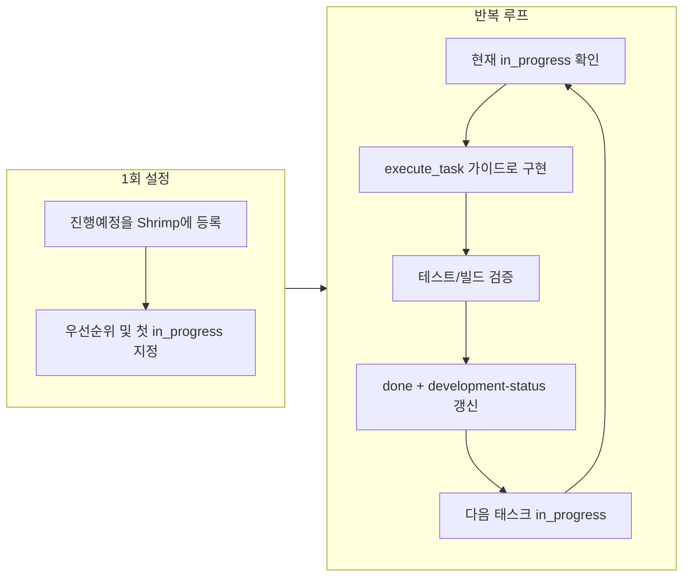

# Shrimp 기반 프로젝트 성공 리드 — 작업/명령 가이드

## 1. 현재 상태 요약

- **개발 현황**: [02-development-status.md](investment-backend/docs/09-planning/02-development-status.md)에 완료 항목이 많고, 진행예정은 Phase·레이어별로 정리되어 있음(메뉴별 API 순차, 백테스트 스트레스 결과 기입, 도메인 E2E, KIS 후속, 대시보드·UX 후속, 연말 세금 고도화 등).
- **Shrimp 규칙**: 모든 개발은 Shrimp 태스크로만 진행; todo → in_progress → blocked → done 생명주기; Epic → Feature → Technical Task → Subtask 분해; 의존성·인프라 우선.
- **Shrimp MCP 도구**: `list_tasks`, `query_task`, `plan_task`, `split_tasks`, `execute_task`, `update_task`, `get_task_detail`, `verify_task`, `init_project_rules` 등.

---

## 2. 추천 작업/명령 순서

### 2.1 1단계: Shrimp와 문서 정합 (최초 1회)

| 순서  | 사용자가 내릴 명령/작업                                                                                                  | 목적                                |
| --- | -------------------------------------------------------------------------------------------------------------- | --------------------------------- |
| 1   | "development-status와 roadmap의 진행예정 항목을 Shrimp에 반영해줘. Epic/Feature 수준으로 먼저 등록하고, 의존성 순서대로 Technical Task로 쪼개줘." | 진행예정을 Shrimp 태스크 트리로 옮겨 단일 소스로 관리 |
| 2   | "Shrimp `list_tasks`로 현재 태스크 목록 보여줘. 진행중(in_progress)은 하나만 두고 나머지는 todo로 맞춰줘."                                 | 규칙 준수: 동시 in_progress 1개만         |
| 3   | (선택) "Shrimp `init_project_rules`로 이 프로젝트 표준을 초기화/갱신해줘."                                                       | Shrimp 쪽 프로젝트 표준 문서와 룰 동기화        |

**실행 시 유의**: `split_tasks` 사용 시 `updateMode`를 `append`로 해서 기존 완료 태스크를 유지하면서 진행예정만 추가하는 것이 안전함. 새 프로젝트처럼 완전히 갈아엎을 때만 `clearAllTasks` 후 재등록.

---

### 2.2 2단계: 우선순위 확정 및 “다음 할 일” 고정

| 순서  | 사용자가 내릴 명령/작업                                                                                | 목적                           |
| --- | -------------------------------------------------------------------------------------------- | ---------------------------- |
| 4   | "진행예정 중에서 필수(도메인 E2E, 백테스트 스트레스 결과 기입)를 최우선으로 하고, 그 다음에 메뉴별 API 순차·KIS 후속 순으로 우선순위 목록 만들어줘." | 리스크·검증 우선으로 실행 순서 확정         |
| 5   | "지금 Shrimp에서 다음으로 진행할 태스크 1개 정해줘. 의존성 만족한 것 중에서 골라서 in_progress로 올려줘."                       | “현재 태스크” 명시 — AI가 코딩 시 범위 고정 |

규칙상 **인프라/안정성 태스크가 기능 확장보다 먼저**이므로, 예: 도메인 E2E 검증 → 백테스트 스트레스 결과 기입 → 메뉴별 API 순차 순을 권장.

---

### 2.3 3단계: 반복 실행 루프 (매 세션/매일)

매 개발 세션 또는 “한 번 일 시키기”마다 아래 순서로 명령을 주면, Shrimp 규칙을 지키면서 진행할 수 있음.

| 순서  | 사용자가 내릴 명령/작업                                                                                                                     | 목적                           |
| --- | --------------------------------------------------------------------------------------------------------------------------------- | ---------------------------- |
| 6   | "현재 in_progress인 Shrimp 태스크가 뭔지 알려줘. 그 태스크의 scope와 완료 조건을 요약해줘."                                                                  | 현재 작업 범위·완료 조건 상기            |
| 7   | "그 태스크에 대해 Shrimp `execute_task`로 실행 가이드를 받고, 그 가이드대로 구현해줘. 완료되면 테스트/빌드로 검증한 뒤 Shrimp에서 done으로 표시하고 development-status에 완료 반영해줘." | 구현 → 검증 → done → 문서 갱신 한 사이클 |
| 8   | "방금 완료한 태스크의 다음으로 올 태스크 1개를 골라서 in_progress로 바꿔줘. blocked면 이유 적어줘."                                                               | 다음 “현재 태스크” 지정               |
| 9   | (필요 시) "이 태스크는 너무 크니까 Shrimp `split_tasks`로 1–2일 단위 서브태스크로 쪼개줘. 의존성 붙여줘."                                                         | 큰 작업은 규칙대로 분해                |

**한 줄로 요약한 명령 예시**:  
“지금 Shrimp in_progress 태스크 확인하고, execute_task 가이드 따라 구현한 다음 테스트 통과하면 done 처리하고 development-status 갱신해. 그다음 할 태스크 하나 in_progress로 올려줘.”

---

### 2.4 4단계: 블로커·범위 creep 대응

| 상황              | 사용자가 내릴 명령/작업                                                                                 |
| --------------- | --------------------------------------------------------------------------------------------- |
| 다른 일이 먼저 필요할 때  | "이 태스크는 [원인] 때문에 막혀 있어. Shrimp에서 blocked로 바꾸고, 블로커 해소용 태스크를 새로 만들어서 먼저 진행해줘."                 |
| 범위가 불명확하거나 커질 때 | "이 태스크의 완료 조건을 Shrimp와 development-status 기준으로 명확히 정의해줘. 필요하면 plan_task로 재계획해줘."              |
| 진행 상황 점검        | "Shrimp list_tasks status=all 로 전체 목록 보여주고, todo/in_progress/blocked/done 개수와 다음 권장 액션 요약해줘." |

---

## 3. Shrimp ↔ 프로젝트 문서 연동

- **development-status**: 태스크를 `done` 처리할 때마다 해당 문서의 “1. 완료”에 항목 추가하고, “2. 진행중”이 바뀌면 갱신. (규칙: [development-status.mdc](.cursor/rules/development-status.mdc))
- **roadmap**: Phase·체크리스트는 development-status를 우선으로 하고, 완료 반영 후 필요 시 roadmap만 동기화.
- **API/설계 변경**: 구현 중 시그니처·정책이 바뀌면 [02-api-endpoints.md](investment-backend/docs/04-api/02-api-endpoints.md), [00-strategy-registry.md](investment-backend/docs/02-architecture/00-strategy-registry.md), [decisions.md](investment-backend/docs/decisions.md) 등 해당 문서 즉시 수정. (같은 룰 파일 참조)

---

## 4. 워크플로우 다이어그램

---

## 5. 요약: “무슨 명령을 내릴까?”

1. **최초 1회**: “진행예정을 Shrimp Epic/Feature/Technical Task로 옮기고, in_progress는 하나만 두어줘.”
2. **우선순위**: “필수(도메인 E2E, 스트레스 결과) 먼저, 그다음 메뉴별 API·KIS 후속 순으로 정렬해줘.”
3. **매 세션**: “지금 in_progress 태스크 execute_task 가이드대로 구현 → 검증 → done 처리 → development-status 반영 → 다음 태스크 in_progress로 올려줘.”
4. **점검**: “Shrimp list_tasks all 로 현황 요약해줘.”
5. **막힐 때**: “이 태스크 blocked로 하고, 블로커 해소 태스크 만들어서 먼저 진행해줘.”

이 순서대로 명령을 주면, Shrimp Task Manager와 프로젝트 룰에 맞춰 “현재 태스크 → 검증 → 완료 → 문서 갱신 → 다음 태스크”가 반복되며 프로젝트를 완료까지 이끌 수 있다.