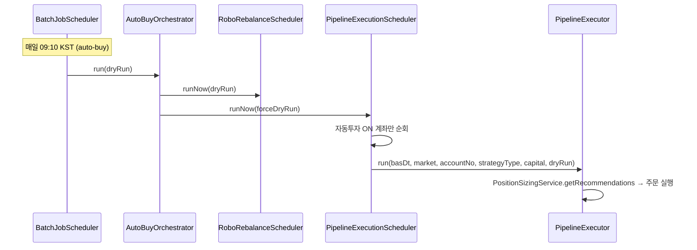

# 자동매매 실행 선행 조건 종합

## 1. 자동매매 실행 흐름 요약

- **트리거**: `auto-buy` Job (cron `0 10 9 * `* *, 09:10 KST). 수동 트리거: `POST /api/v1/trigger/auto-buy` (인증 필요).
- **실제 주문 여부**: 서버/계정별 `pipeline.autoExecute` = true 이어야 하며, 실전 계좌는 추가로 `pipeline.allowRealExecution`(또는 계정별) true 필요.

---

## 2. 선행 조건 체크리스트 (실행되기 위해 필요한 것)

### 2.1 인프라·환경

| 구분         | 조건                                               | 비고                                                                                                                         |
| ---------- | ------------------------------------------------ | -------------------------------------------------------------------------------------------------------------------------- |
| DB         | Spring Batch 메타데이터 테이블 존재 (V20 마이그레이션)           | 없으면 배치 Job 스킵. [01-local-setup-complete.md](investment-backend/docs/08-setup-guides/01-local-setup-complete.md) §문제 해결 참조. |
| Redis      | 연결 가능                                            | 캐시·세션 등 (선택에 따라 필수).                                                                                                       |
| Backend 기동 | 정상 기동 후 `BatchJobScheduler`에서 auto-buy 등 cron 등록 | 로그: `Scheduled batch job: id=auto-buy, cron=0 10 9 * `* *.                                                                 |

### 2.2 데이터 파이프라인 (선행 배치/수집)

자동매수(파이프라인)는 **전일 기준일(basDt)** 의 유니버스·시그널을 사용한다. 따라서 **당일 09:10 실행** 전에 아래가 선행되어 있어야 한다.

| 순서  | Job/수집       | 스케줄(기본)      | 산출물                          | 비고                                                                                                                                                                      |
| --- | ------------ | ------------ | ---------------------------- | ----------------------------------------------------------------------------------------------------------------------------------------------------------------------- |
| 1   | KRX 일별 시세 수집 | 16:00 KST 전일 | TB_DAILY_STOCK (MARKET=KR)   | [KrxCollectionService](investment-backend/src/main/java/com/investment/datacollection/service/KrxCollectionService.java). KRX AUTH_KEY 등 설정.                            |
| 2   | US 일별 시세 수집  | 17:00 KST 전일 | TB_DAILY_STOCK (MARKET=US)   | [UsMarketCollectionService](investment-backend/src/main/java/com/investment/datacollection/service/UsMarketCollectionService.java). yfinance 스크립트 또는 data-collector 연동. |
| 3   | 팩터 계산        | 08:00 KST    | TB_UNIVERSE, TB_SIGNAL_SCORE | [FactorCalculationScheduler](investment-backend/src/main/java/com/investment/factor/scheduler/FactorCalculationScheduler.java). 유니버스 필터 → 시그널 저장.                       |

- **결론**: 09:10 실행일 기준, **전일 16:00/17:00 수집**과 **당일 08:00 팩터 계산**이 먼저 성공해야 파이프라인에서 권장 포지션을 산출할 수 있다. 재기동이 16:00/17:00 이후인 경우 [13-manual-operator-tasks.md §1.8](investment-backend/docs/06-deployment/13-manual-operator-tasks.md) 에 따라 KRX/US 일별 수집을 수동 트리거할 것.

### 2.3 계좌·설정 (관리자/사용자)

| 항목           | 저장 위치                                    | 조건                                                                                                                             |
| ------------ | ---------------------------------------- | ------------------------------------------------------------------------------------------------------------------------------ |
| 한국투자증권 계좌 등록 | TB_USER_ACCOUNTS                         | 계좌번호(암호화), brokerType=KOREA_INVESTMENT, serverType(0=실전, 1=모의). 토큰 발급용 앱키/시크릿은 env 또는 연동 저장.                                   |
| 거래 설정        | TB_TRADING_SETTINGS                      | 동일 계좌에 1행. **AUTO_TRADING_ENABLED = true**. **MAX_INVESTMENT_AMOUNT > 0** (또는 서버 기본값 `pipeline.scheduler.defaultCapital` > 0). |
| 파이프라인 실제 주문  | TB_TRADING_SETTINGS / TB_SYSTEM_SETTINGS | **PIPELINE_AUTO_EXECUTE = true** (계정별 또는 서버 기본). 미설정 시 application.yml 기본값 사용(`investment.pipeline.auto-execute`).             |
| 실전 계좌 주문 허용  | TB_TRADING_SETTINGS / env                | 실전(serverType=0)일 때만. **PIPELINE_ALLOW_REAL_EXECUTION = true** (계정별 또는 서버). 기본은 false(모의만 주문).                                 |

- **전략(Strategy)**: 계좌·시장별로 전략이 없으면 [StrategyManagementService.getStrategies(accountNo, market)](investment-backend/src/main/java/com/investment/strategy/service/StrategyManagementService.java) 호출 시 **시스템 기본 3건(단기/중기/장기) 자동 생성**. 파이프라인 실행 시에는 해당 계좌+시장+strategyType에 대해 **중지(STOPPED)/일시정지(PAUSED)가 아니어야** run 호출됨.

### 2.4 런타임 게이트 (실행 시점 검사)

[PipelineExecutionScheduler.runNow](investment-backend/src/main/java/com/investment/factor/scheduler/PipelineExecutionScheduler.java) 내부에서 다음을 검사한다. 하나라도 실패하면 해당 계좌는 **스킵** (로그에 사유 출력).

| 게이트           | 조건                                                                 | 비고                                                                                                                         |
| ------------- | ------------------------------------------------------------------ | -------------------------------------------------------------------------------------------------------------------------- |
| 자동투자 ON 계좌 존재 | `findAllByAutoTradingEnabledTrue()` 비어 있지 않음                       | 없으면 "자동투자 ON 계좌 없음" 후 종료.                                                                                                  |
| 자본            | `MAX_INVESTMENT_AMOUNT` 또는 `pipeline.scheduler.defaultCapital` > 0 | 0이면 "자본 미설정" 스킵.                                                                                                           |
| 리스크 게이트       | `RiskGateService.evaluate` → **allowNewBuy == true**               | 레짐·VIX 등. 불가 시 "리스크 게이트 신규 매수 불가".                                                                                         |
| 시장 급락 게이트     | `MarketCrashGateService.isNewBuyAllowed()` == true                 | 불가 시 "시장 급락 게이트 신규 매수 중단".                                                                                                 |
| 일일 손실 한도      | `DailyLossLimitService.isNewBuyAllowed(accountNo)` == true         | 당일 손실 한도 초과 시 "일일 손실 한도 초과" 스킵. (당일 시초 잔고는 **recordOpeningBalanceIfAbsent**로 첫 실행 시 기록.)                                   |
| 거버넌스 Halt     | `GovernanceHaltService.isHalted(market, strategyType)` == false    | (market, strategyType)별 halt 있으면 해당 조합 run 스킵. Ops에서 해제: `PUT /api/v1/ops/governance/halts/{market}/{strategyType}/clear`. |
| 전략 상태         | 해당 계좌·시장·strategyType의 Strategy가 **중지/일시정지 아님**                    | STOPPED/PAUSED면 해당 run 스킵.                                                                                                 |

### 2.5 로보 리밸런싱(선택)

[RoboRebalanceScheduler](investment-backend/src/main/java/com/investment/backtest/robo/RoboRebalanceScheduler.java)는 **자동투자 ON + 로보 어드바이저 ON** 계좌만 대상으로, **실행 전 백테스트**(최근 N개월)를 수행하고 MDD/Sharpe 기준 통과 시에만 `RoboRebalanceExecutor.executeRebalance` 호출한다.  

- 선행 데이터: US 일봉(SPY, TLT 등) 등 로보 백테스트용 데이터 수집 완료.  
- 설정: `investment.backtest.robo.execute-orders`(기본 false), `pre-execution-lookback-months`, `pre-execution-max-mdd-pct`, `pre-execution-min-sharpe`.

### 2.6 주문 실행 시 추가 조건 (PipelineExecutor)

- **실전 계좌**: `resolveServerTypeForAccount` → serverType=0 이면, **allow-real-execution** 이 true가 아니면 주문 스킵(실전 계좌 자동 실행 미허용).  
- **한국투자증권 토큰**: 주문 API 호출 시 유효한 액세스 토큰 필요. 토큰 갱신 로직/스케줄 확인.  
- **PositionSizingService.getRecommendations**: TB_SIGNAL_SCORE(및 유니버스/일봉) 기반으로 권장 포지션 산출. 시그널이 없으면 권장 0건일 수 있음(주문 없음).

---

## 3. 관리자(운영자) 유저가 해야 할 작업

다음은 [13-manual-operator-tasks.md](investment-backend/docs/06-deployment/13-manual-operator-tasks.md) 및 설정 문서 기준 **수동 작업**이다.

### 3.1 환경·시크릿

- **Backend `.env`(또는 배포 환경 변수)**  
  - `PIPELINE_AUTO_EXECUTE`(서버 기본 자동 실행), `PIPELINE_ALLOW_REAL_EXECUTION`(실전 허용 여부), `PIPELINE_SCHEDULER_DEFAULT_CAPITAL`(계정별 자본 미설정 시 기본값).  
  - 한국투자증권: 모의 `SUPER_ADMIN_VIRTUAL_APP_KEY/SECRET/ACCOUNT_NO` 또는 사용자별 연동.  
  - (선택) `PIPELINE_ALERT_DISCORD_WEBHOOK_URL` — 미체결/리스크 알림.

### 3.2 DB·설정

- **TB_TRADING_SETTINGS**: 자동매매할 계좌에 대해  
  - `AUTO_TRADING_ENABLED = true`,  
  - `MAX_INVESTMENT_AMOUNT` > 0,  
  - 필요 시 `PIPELINE_AUTO_EXECUTE = true`, 실전이면 `PIPELINE_ALLOW_REAL_EXECUTION = true`.
- **TB_USER_ACCOUNTS**: 해당 계좌가 한국투자증권으로 등록되어 있고, `USER_ID`와 TB_TRADING_SETTINGS와의 매칭(계좌번호 기준)이 앱에서 일치하도록 유지.  
- (선택) **TB_SYSTEM_SETTINGS**: `pipeline.autoExecute`, `pipeline.allowRealExecution`, `pipeline.scheduler.defaultCapital` 등 서버 기본값을 DB에서 관리하는 경우 값 설정.

### 3.3 데이터 파이프라인 보정

- **Backend 재기동이 16:00/17:00(KST) 이후인 경우**: 당일 KRX/US 일별 수집이 스케줄대로 돌지 않았을 수 있음.  
  - Ops → 스케줄 현황에서 **KRX 일별 수집**, **US 시장 일별 수집** 각각 **지금 실행** 또는  
  - `POST /api/v1/trigger/krx-daily`, `POST /api/v1/trigger/us-daily` 호출(인증 필요).
- **팩터 계산**: 동일하게 **지금 실행** 또는 `POST /api/v1/trigger/factor-calculation`.

### 3.4 거버넌스·모니터링

- **전략 거버넌스 Halt**: Ops → 전략 거버넌스에서 활성 halt 확인. 자동매매를 재개하려면 해당 (market, strategyType)에 대해 **halt 해제** (`PUT .../halts/{market}/{strategyType}/clear`).  
- **전략 거버넌스 검사 이력 없음**: 최초 1회 수동 트리거 또는 매월 1일 02:00 스케줄 대기.  
- (선택) **Discord 긴급 알림**: Webhook URL 설정 후 `POST /api/v1/trigger/discord-test`로 테스트.

### 3.5 인프라(배포 환경)

- 스왑 확인·설정(OCI/AWS 등), Certbot 갱신 cron, Cloudflare 521 대응 등은 [13-manual-operator-tasks.md](investment-backend/docs/06-deployment/13-manual-operator-tasks.md) §1.4~§1.7 참조.

---

## 4. 코드에 추가/보완하면 좋은 것

- **문서 일치**: application.yml의 `investment.pipeline.auto-execute` 기본값이 `true`인데, [12-auto-investment-strategy.md](investment-backend/docs/02-architecture/12-auto-investment-strategy.md)에는 "기본값은 false라 설정하지 않으면 dry-run만"이라고 되어 있으면, **중 하나로 통일** (실제 의도에 맞게 yml 또는 문서 수정).  
- **시작 시 검증(선택)**: Backend 기동 시 또는 Ops용 **“자동매매 준비 상태”** API/화면:  
  - 자동투자 ON 계좌 수,  
  - 전일 TB_DAILY_STOCK/TB_SIGNAL_SCORE 존재 여부(또는 basDt 기준 row 수),  
  - 활성 거버넌스 halt 수  
  등을 한 번에 조회해, 09:10 전에 관리자가 점검하기 쉽게 할 수 있음.
- **에러 메시지 보강**: 파이프라인 스킵 시 로그에 이미 계좌·사유가 있으나, 감사/운영을 위해 **스킵 사유 코드**를 정리해 로그/알림에 일관되게 남기면 추적에 유리함.

---

## 5. 파이썬 프로젝트 점검 요소

자동매매 **실행** 자체는 Backend(Java)에서 이루어지며, 파이썬 프로젝트는 **데이터 수집·예측**을 보조한다.

### 5.1 investment-data-collector

| 점검 항목    | 설명                                                                                                                                              |
| -------- | ----------------------------------------------------------------------------------------------------------------------------------------------- |
| 기동·헬스    | 서비스 기동 후 `GET /health` 200. (풀스택: 8001 등)                                                                                                       |
| US 일봉    | Backend가 US 일별 수집을 **data-collector에 위임**하는 구성이면, `POST /us-daily` 호출 가능 여부 및 응답 형식(JSON 배열 등) 검증.                                              |
| DART/SEC | 공시 수집 후 Spring `POST /api/v1/internal/collected-news` 전달. 자동매매 시그널(뉴스 시그널) 사용 시 수집 스케줄·키 설정 확인.                                                 |
| 환경 변수    | DART_API_KEY, SEC 관련, DATA_COLLECTION_INTERNAL_KEY 등. [10-data-collection-api.md](investment-backend/docs/04-api/10-data-collection-api.md) 참조. |

### 5.2 investment-prediction-service (AI/LSTM)

| 점검 항목  | 설명                                                                                                    |
| ------ | ----------------------------------------------------------------------------------------------------- |
| 기동·헬스  | `GET /`, `GET /api/v1/health` 200.                                                                    |
| 예측 API | `POST /api/v1/predict`, `POST /api/v1/predict/batch` — 전략에서 AI 분석을 쓰는 경로만 해당. 자동매매가 **규칙 엔진만** 쓰면 선택. |
| 단위 테스트 | `python -m unittest discover` (requirements.txt 설치 후). [최종_QA_체크리스트.md](plans/qa/최종_QA_체크리스트.md) §4.  |

### 5.3 Backend 연동 설정

- **application.yml / .env**:  
  - US 일봉을 스크립트로 쓸 때: `investment.data.us.yfinance-script-path`, `investment.data.us.python-command` 등.  
  - US 일봉을 data-collector URL로 쓸 때: 해당 URL(예: `US_COLLECTOR_URL`) 설정.
- **풀 QA**: `run-python-qa.ps1` 및 `run-full-qa.ps1`에서 Python 서비스 상태 코드·응답 스키마 검증. [qa-automation-flow.mdc](.cursor/rules/qa-automation-flow.mdc) 참조.

---

## 6. 요약: 자동매매가 “한 번이라도 실제 주문까지” 되려면

1. **인프라**: DB(배치 메타데이터 포함), Redis(필요 시), Backend 기동 → auto-buy 스케줄 등록.
2. **데이터**: 전일 KRX/US 일별 수집 완료 → 당일 08:00 팩터 계산 완료 → TB_UNIVERSE, TB_SIGNAL_SCORE 존재.
3. **계좌·설정**: 한국투자증권 계좌 등록, TB_TRADING_SETTINGS에 자동투자 ON, MAX_INVESTMENT_AMOUNT > 0, PIPELINE_AUTO_EXECUTE = true(또는 서버 기본 true). 실전이면 PIPELINE_ALLOW_REAL_EXECUTION 허용.
4. **게이트**: 리스크/시장급락/일일손실한도/거버넌스 halt 통과, 전략 중지·일시정지 아님.
5. **주문 경로**: 실전 계좌면 allow-real-execution true, 한국투자증권 토큰 유효, PositionSizingService가 권장 1건 이상 산출.
6. **관리자**: 위 설정·수집·halt 해제 등 수동 작업 수행 후, 필요 시 수동 트리거로 1회 검증(`POST /api/v1/trigger/auto-buy?dryRun=true` → dryRun=false 또는 스케줄 대기).

이 계획을 기준으로 체크리스트·운영 문서(예: 13-manual-operator-tasks.md)에 “자동매매 가동 전 점검” 절을 추가해 두면 운영 시 반복 검증에 유리하다.