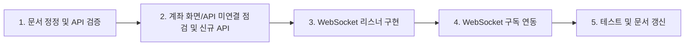

# 한국투자증권 API 검증 및 WebSocket·계좌 연동 계획

## 현황 요약

- **계좌/주문 API**: [KoreaInvestmentAccountClient](investment-backend/src/main/java/com/investment/account/client/KoreaInvestmentAccountClient.java), [KoreaInvestmentOrderClient](investment-backend/src/main/java/com/investment/order/client/KoreaInvestmentOrderClient.java)가 [10-korea-investment-api-spec](investment-backend/docs/04-api/10-korea-investment-api-spec.md) 및 [09 가이드](investment-backend/docs/04-api/09-korea-investment-api-guide.md)에 정의된 path·TR_ID와 대부분 일치.
- **실시간 시세**: [RealtimeMarketDataService](investment-backend/src/main/java/com/investment/marketdata/service/RealtimeMarketDataService.java)는 `webSocketLivePrices`를 우선 조회하나, **WebSocket 수신 데이터를 이 맵에 넣어 주는 리스너가 없음**. [KoreaInvestmentWebSocketClientImpl](investment-backend/src/main/java/com/investment/marketdata/websocket/KoreaInvestmentWebSocketClientImpl.java)은 `WebSocketDataEvent`만 발행하고, **어떤 컴포넌트도 `subscribeQuote(userId, serverType, symbols)`를 호출하지 않음** (연결 후 보유 종목/단타 대상 구독 누락).

---

## 1. 문서 대비 로직·기술 검증

### 1.1 검증 대상 및 기준

| 대상                                                                                                                                           | 기준 문서                                                                                                                                                                                                                                   | 검증 항목                                       |
| -------------------------------------------------------------------------------------------------------------------------------------------- | --------------------------------------------------------------------------------------------------------------------------------------------------------------------------------------------------------------------------------------- | ------------------------------------------- |
| [KoreaInvestmentAccountApiConstants](investment-backend/src/main/java/com/investment/account/client/KoreaInvestmentAccountApiConstants.java) | [10-korea-investment-api-spec.md](investment-backend/docs/04-api/10-korea-investment-api-spec.md), [09-domestic-stock-order-account.md](investment-backend/docs/04-api/10-korea-investment-api-spec/09-domestic-stock-order-account.md) | PATH·TR_ID 일치 (GET/POST, 실전/모의)             |
| KoreaInvestmentAccountClient 각 메서드                                                                                                           | 위 + [09 가이드](investment-backend/docs/04-api/09-korea-investment-api-guide.md)                                                                                                                                                           | GET + query, Hashkey 필요 시 생성, 공통 헤더·파라미터    |
| KoreaInvestmentOrderClient                                                                                                                   | 명세서 주문(현금) path·TR_ID                                                                                                                                                                                                                   | POST body, TTTC0011U/0012U, VTTC0011U/0012U |
| KoreaInvestmentMarketDataClient                                                                                                              | [03-domestic-stock-price-basic](investment-backend/docs/04-api/10-korea-investment-api-spec/03-domestic-stock-price-basic.md) 또는 09 가이드                                                                                                 | 현재가 API path·TR_ID (FHKST01010100 등)        |
| KoreaInvestmentRankClient                                                                                                                    | application.yml rank-api, 06-domestic-stock-rank                                                                                                                                                                                        | volume-rank·investor-daily path·TR_ID       |

### 1.2 문서 정정 (1건)

- **[09-domestic-stock-order-account.md](investment-backend/docs/04-api/10-korea-investment-api-spec/09-domestic-stock-order-account.md)** §6 기간별손익일별합산: Path가 `inquire-period-profit`로 되어 있으나, 코드·메인 명세는 `inquire-period-profit-loss` 사용. **Path를 `inquire-period-profit-loss`로 수정**하여 코드·[10-korea-investment-api-spec.md](investment-backend/docs/04-api/10-korea-investment-api-spec.md)와 일치시킨다.

### 1.3 코드 검증 작업

- AccountClient: `inquireBalance`, `inquireOverseasBalance`, `inquireBuyableAmount`, `inquireSellableQuantity`, `inquireOrderHistory`, `inquireAssets`, `inquirePeriodProfitLoss` 각각 PATH/TR_ID/메서드(GET)·쿼리 키 이름을 명세와 대조. 필요 시 한국투자증권 MCP로 스펙 재확인.
- OrderClient: `placeBuyOrder`/`placeSellOrder` path `/uapi/domestic-stock/v1/trading/order-cash`, TR_ID, POST body 필드.
- MarketDataClient: `getCurrentPrice` 호출 path·TR_ID가 국내주식 현재가 API 명세와 일치하는지 확인.
- 검증 결과는 주석 또는 개발 현황 문서에 요약 반영 (불일치 시 코드를 명세 기준으로 수정).

---

## 2. 계좌조회 등 미연결·신규 개발

### 2.1 이미 연동된 API

- [AccountController](investment-backend/src/main/java/com/investment/api/controller/AccountController.java): 잔고·보유종목, 매수가능·매도가능, 주문체결조회, 투자계좌자산현황, 기간별손익 모두 **백엔드에 구현·노출**되어 있으며, [accountApi.ts](investment-frontend/src/api/accountApi.ts)에 `getOrderHistory`, `getPeriodProfitLoss`, `getAccountAssets` 등 **함수 존재**. 즉 “계좌조회 등 사용이 돼야 하는데 연결이 안 돼 있는 부분”은 **특정 화면에서 해당 API를 호출하지 않는 경우**이거나 **명세에는 있으나 백엔드에 아직 없는 API**이다.

### 2.2 화면·플로우 점검

- 대시보드·계좌/주문 화면에서 **주문체결조회(order-history)**, **투자계좌자산현황(assets)**, **기간별손익(profit-loss)** 호출 여부 확인. 미호출 화면이 있으면 해당 화면에서 위 API 호출을 추가한다 ([11-api-frontend-mapping.md](investment-backend/docs/04-api/11-api-frontend-mapping.md) 참고).

### 2.3 명세서 기준 신규 API (선택)

- [09-domestic-stock-order-account.md](investment-backend/docs/04-api/10-korea-investment-api-spec/09-domestic-stock-order-account.md) 및 메인 명세서에 있으나 **현재 미구현**인 API 예:
  - **주식정정취소가능주문조회** (TTTC8002R/VTTC8002R): 주문 취소/정정 UI에서 “취소 가능 주문 목록” 조회용.
  - **주식잔고조회_실현손익** (TTTC8494R/VTTC8494R): 잔고별 실현손익.
  - **기간별매매손익현황조회** (TTTC8709R/VTTC8709R): 기간별 매매손익 현황.
- 우선순위는 요구사항에 따라 정한다. 필요 시 **명세서(Header/Parameter/Response)**를 참고해 `KoreaInvestmentAccountClient`에 메서드 추가 → `AccountService`·`AccountController`에 노출.

---

## 3. 실시간 데이터·단타를 위한 WebSocket 활용

### 3.1 문제 정리

- **수신 데이터가 시세 캐시에 반영되지 않음**: `KoreaInvestmentWebSocketClientImpl`은 호가/체결 수신 시 `WebSocketDataEvent`만 발행한다. 이를 구독해 `RealtimeMarketDataService.updateFromWebSocket(symbol, CurrentPriceDto)`를 호출하는 **컴포넌트가 없음**. 따라서 `webSocketLivePrices`는 항상 비어 있고, 단타/청산은 **REST + 캐시**만 사용한다.
- **호가/체결 구독이 이뤄지지 않음**: `subscribeQuote(userId, serverType, symbols)`는 **재연결 시 `restoreSubscriptions`에서만** 호출되며, `subscribedSymbols`는 **다른 코드에서 채워주지 않음**. 즉 연결 후 “보유 종목” 또는 “단타 대상 종목”에 대한 구독 요청을 하는 주체가 없음.

### 3.2 WebSocket 수신 → 시세 캐시 반영 (필수)

- **WebSocketPriceCacheListener** (또는 동일 역할의 컴포넌트) **신규 구현**:
  - `ApplicationListener<WebSocketDataEvent>` 또는 `@EventListener(WebSocketDataEvent.class)`로 이벤트 수신.
  - 이벤트의 `tr_id`(및 필요 시 payload 형식)에 따라 파싱: **호가(quote-tr-id, 예: H0GASP0)** 또는 **체결(execution-tr-id)** 등. 명세: [05-domestic-stock-realtime.md](investment-backend/docs/04-api/10-korea-investment-api-spec/05-domestic-stock-realtime.md), [01-oauth](investment-backend/docs/04-api/10-korea-investment-api-spec/01-oauth.md) 웹소켓 접속키.
  - 종목코드·현재가(및 필요 시 고가 등) 추출 후 `CurrentPriceDto` 생성.
  - `RealtimeMarketDataService.updateFromWebSocket(symbol, dto)` 호출.
- KIS 실시간 메시지 포맷(파이프 `|` 구분 또는 JSON)은 [09 가이드](investment-backend/docs/04-api/09-korea-investment-api-guide.md)·명세서·실제 응답 예시에 맞춰 파싱 로직 작성. 단위 테스트: 가짜 `WebSocketDataEvent`로 리스너 호출 시 `updateFromWebSocket` 호출 및 DTO 내용 검증.

### 3.3 단타/청산용 WebSocket 호가·체결 구독 연동 (필수)

- **구독 주체 도입**: WebSocket이 연결된 뒤, **보유 종목(청산 대상)** 및 필요 시 **단타/돌파 후보 종목**에 대해 `KoreaInvestmentWebSocketClient.subscribeQuote(userId, serverType, symbols)`가 호출되도록 한다.
- 구현 방안 (택일 또는 조합):
  - **WebSocketConnectScheduler**(또는 연결 성공 콜백)에서: 연결 성공 시점에 **보유 포지션이 있는 계좌**의 종목 목록을 조회(`StrategyPositionRepository.findDistinctSymbolsWithOpenPositions()` 등)하고, 해당 계좌의 `userId`·`serverType`에 대해 `webSocketClient.subscribeQuote(userId, serverType, symbolList)` 호출.
  - **PipelineExitScheduler** / **IntradayBreakoutScheduler** 실행 시: `websocket.enabled`이고 이미 연결된 경우, 이번 평가 대상 종목들에 대해 `subscribeQuote` 호출(이미 구독된 종목은 Impl 내부에서 중복 방지).
- `KoreaInvestmentWebSocketClient`는 이미 `@Autowired(required = false)` 또는 조건부 빈으로 주입 가능하므로, 위 스케줄러/서비스에서 optional하게 주입해 `enabled`일 때만 구독 호출하면 된다.
- 명세서의 **실시간 시세 TR_ID·키 형식**(tr_key = 종목코드 등)과 [KoreaInvestmentWebSocketClientImpl](investment-backend/src/main/java/com/investment/marketdata/websocket/KoreaInvestmentWebSocketClientImpl.java)의 `buildSubscribeMessage(tr_id, tr_key)` 사용 방식을 맞춘다.

### 3.4 설정·문서

- 단타/청산 시 현재가 TTL이 길면 실시간에 가깝지 않으므로, [development-status](investment-backend/docs/09-planning/02-development-status.md)에 나온 대로 **현재가 캐시 TTL**을 `investment.market-data.current-price-cache-ttl-seconds` 등으로 프로퍼티화하고, 단타/청산용 프로파일에서는 5분보다 짧게(예: 60초 이하) 설정할 수 있게 한다 (선택).
- [14-multi-account-realtime-streaming.md](investment-backend/docs/02-architecture/14-multi-account-realtime-streaming.md)에 **WebSocketPriceCacheListener** 역할과 **구독 트리거(보유 종목/단타 대상)** 연동 방식을 반영한다.

---

## 4. 작업 순서 제안

1. **문서 정정 및 API 검증**: 09 세부 명세 기간 Path 수정, Account/Order/MarketData 클라이언트를 명세서와 대조해 수정·주석 반영.
2. **계좌·주문**: 프론트 매핑 문서·대시보드/계좌 화면에서 order-history, assets, profit-loss 호출 여부 확인 후 미연결 화면에 API 연동; 필요 시 정정취소가능주문·실현손익·기간별현황 등 신규 API 추가.
3. **WebSocket 리스너**: WebSocketPriceCacheListener 구현, WebSocketDataEvent → 파싱 → `updateFromWebSocket` 호출 및 단위 테스트.
4. **WebSocket 구독 연동**: 연결 성공 시 또는 청산/단타 스케줄러에서 보유·대상 종목으로 `subscribeQuote` 호출.
5. **테스트 및 문서**: RealtimeMarketDataService WebSocket 우선 조회·PipelineExitScheduler/IntradayBreakout 동작 확인, 14-multi-account-realtime-streaming·development-status 갱신.

---

## 5. 참고 파일

| 구분            | 경로                                                                                                                                                      |
| ------------- | ------------------------------------------------------------------------------------------------------------------------------------------------------- |
| API 명세 (메인)   | [10-korea-investment-api-spec.md](investment-backend/docs/04-api/10-korea-investment-api-spec.md)                                                       |
| API 명세 (세부)   | [10-korea-investment-api-spec/](investment-backend/docs/04-api/10-korea-investment-api-spec/) (09 주문·계좌, 05 실시간 등)                                      |
| 구현 가이드        | [09-korea-investment-api-guide.md](investment-backend/docs/04-api/09-korea-investment-api-guide.md)                                                     |
| 실시간 스트리밍 설계   | [14-multi-account-realtime-streaming.md](investment-backend/docs/02-architecture/14-multi-account-realtime-streaming.md)                                |
| 계좌 클라이언트      | [KoreaInvestmentAccountClient.java](investment-backend/src/main/java/com/investment/account/client/KoreaInvestmentAccountClient.java)                   |
| WebSocket 구현체 | [KoreaInvestmentWebSocketClientImpl.java](investment-backend/src/main/java/com/investment/marketdata/websocket/KoreaInvestmentWebSocketClientImpl.java) |
| 실시간 시세 서비스    | [RealtimeMarketDataService.java](investment-backend/src/main/java/com/investment/marketdata/service/RealtimeMarketDataService.java)                     |

