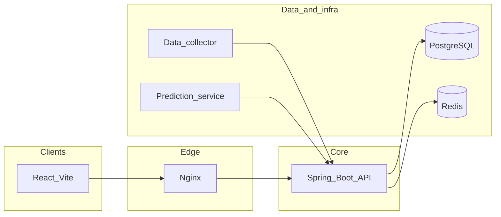

# auto-investment-project

한국 증권 API를 활용한 **분산형 자동 투자·퀀트** 모노레포입니다. 계좌·주문·전략 실행과 포트폴리오 분석을 여러 마이크로서비스로 나눕니다.

## 스택 요약

| 영역 | 기술 |
|------|------|
| API 서버 | Spring Boot 3.2, Java 17, Gradle |
| 웹 클라이언트 | React 18, Vite, TypeScript, Tailwind, Radix UI |
| 데이터·인프라 | PostgreSQL/TimescaleDB, Redis, Docker Compose, Nginx |
| 파이프라인·ML | Python(data collector), 별도 예측 서비스 |

## 저장소 구조 (Git 서브모듈)

각 디렉터리는 **독립 Git 저장소**를 가리킵니다. 부모 저장소는 서브모듈 **커밋 포인터**만 기록합니다.

| 경로 | 역할 |
|------|------|
| [investment-backend](investment-backend/) | Spring Boot API |
| [investment-frontend](investment-frontend/) | React(Vite) SPA |
| [investment-infra](investment-infra/) | Compose, 배포·CI 스크립트 |
| [investment-data-collector](investment-data-collector/) | Python 데이터 수집 |
| [investment-prediction-service](investment-prediction-service/) | ML 추론 서비스 |
| [smart-portfolio-pal](smart-portfolio-pal/) | Lovable 측 참조용(이 저장소에서는 **수정·커밋 금지**) |

루트의 운영·검증 허브: [docs/program/](docs/program/), [docs/verification/](docs/verification/). 에이전트·규칙: [.cursor/](.cursor/), [CLAUDE.md](CLAUDE.md).

## 클론

```bash
git clone --recurse-submodules https://github.com/Layton0-0/auto-investment-project.git
cd auto-investment-project
```

이미 클론만 한 경우:

```bash
git submodule update --init --recursive
```

외부 기여자는 **부모 repo와 연결된 모든 서브모듈 repo가 Public**이어야 위 명령이 동작합니다.

## 빠른 시작

- **풀 로컬 스택(PowerShell):** `investment-infra`에서 `./scripts/local-up.ps1` — [CLAUDE.md](CLAUDE.md)의 Quick Start·포트 표를 참고하세요.
- **백엔드만 / 프론트만** 등 선택 실행도 동일 문서에 정리되어 있습니다.

## 검증

저장소 루트(PowerShell):

- `.\scripts\run-all-tests.ps1` — 백엔드·프론트 단위 및 E2E 등
- `.\scripts\run-full-qa.ps1` — 풀 QA(시간 여유 필요)

허브: [docs/verification/README.md](docs/verification/README.md).

## 운영 흐름(스파인)

방향·계획·실행·검증·기록의 한 줄기: [docs/program/00-operating-flow.md](docs/program/00-operating-flow.md).

## 아키텍처 개요



## 라이선스·기여·보안

- 라이선스: [LICENSE](LICENSE) (MIT).
- 기여 가이드: [CONTRIBUTING.md](CONTRIBUTING.md).
- 취약점 신고: [SECURITY.md](SECURITY.md).
